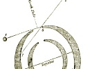

  
[Intangible Textual Heritage](../../index)  [Earth Mysteries](../index) 
[Utopia](../../utopia/index)  [Index](index)  [Previous](sym02) 
[Next](sym04) 

------------------------------------------------------------------------

  
*Symzonia; Voyage of Discovery*, by Adam Seaborn (pseud. John Cleves
Symmes?), \[1820\], at Intangible Textual Heritage

------------------------------------------------------------------------

p. viii

 

 

CHAPTER I.

The Author's reasons for undertaking a voyage of discovery.—He builds a
vessel for his purpose upon a new plan.—His departure from the United
States.

Page [13](sym04.htm#page_13)

CHAPTER II.

The Author arrives at the Falkland Islands—Describes West Point Island,
and States harbour—Visits the city of the Gentoo Penguins on the Grand
Jason—Gives some account of the polity and habits of those civilized
amphibia—Sails for South Georgia.

Page [21](sym05.htm#page_21)

CHAPTER III.

The Author passes South Georgia, and proceeds in search of Sandwich
land—States to his officers and men his reasons for believing in the
existence of great bodies of land within the antarctic circle, and for
the opinion that the polar region is subject to great heat in
summer.—Crew mutiny at the instigation of Mr. Slim, third mate.—Happy
discovery

p. ix

of a southern continent, which, at the unanimous and earnest
solicitation of his officers and men, he names Seaborn's Land.

Page [37](sym06.htm#page_37)

CHAPTER IV.

The Author in great peril, from the vast rise and fall of the tide in
the polar sea—Brief account of his observations at Seaborn's Land—He
takes formal possession of the country, in the manner usual in such
eases, in the name and on behalf of the United States—Leaves a sealing
party on one of the islands near the coast, and proceeds to the south,
to extend his discoveries.

Page [58](sym07.htm#page_58)

CHAPTER V.

The Author discovers the south extremity of Seaborn's Land, which he
names Cape Worldsend.—The compass becomes useless.—He states the manner
in which he obviated the difficulty occasioned thereby.—He enters the
internal world: describes the phenomena which occur.—Discovers Token
Island.—Occurrences at that Island.

Page [76](sym08.htm#page_76)

CHAPTER VI.

The Author departs from Token Island, in search of an internal
continent.—Wind, weather, and other phenomena of the internal
seas.—Great alarm of the crew.—Discovery of an inhabited country

Page [89](sym09.htm#page_89)

CHAPTER VII.

Description of the first view of the coast.—The Author names the
discovered country Symzonia.—Enters the

p. x

harbour.—His first interview with the Symzonian.—Sketch of their
appearance.—He commences the study of the Symzonian language.—Wonderful
powers of mind displayed by the natives.—Account of an aerial vessel.

Page [99](sym10.htm#page_99)

CHAPTER VIII.

The Author leaves the ship to visit the seat of government.—Description
of the country.—Account of the polity of the Symzonians, as stated by
his conductor.—Comparison of the industry, its objects and ends n the
two worlds, and of the necessities and habits of the internals and
externals.—Expulsion of the unworthy from Symzonia, to a place of exile
near the north pole.—External world supposed to have been peopled by the
outcasts.

Page [117](sym11.htm#page_117)

CHAPTER IX.

The Author arrives at the seat of government.—Description of the
Auditory.—Symzonian manner of assembling for devotion and public
business.—Etiquette of the Symzonian Court.—He is admitted to an
audience by the Best Man.—Account of the interview, and of his
unfortunate efforts to exalt the character of the externals, by
describing some of their splendid follies.

Page [135](sym12.htm#page_135)

CHAPTER X.

Containing some account of the strange rationality of the
Symzonians.—Their simplicity of dress.—Manner of making
cloth.—Circulating medium.—Taxes.

Page [156](sym13.htm#page_156)

p. xi

CHAPTER XI.

Containing some account of the Symzonian engine of defence.—Story of a
very ancient war with an internal nation called Belzubians, which caused
the invention of this engine.—Opposition of the Good men to its being
used.—Fultria the inventor's speech in defence of it.—Deliberations of
the Council.—Termination of the war.—Sentiments of the people on the
subject.

Page [165](sym14.htm#page_165)

CHAPTER XII.

Wonderful faculties of the Symzonians.—Translation of my books into
their language.—Proposition of a Wise man to make slaves of the Author
and his people.—The Author's remonstrance.—The Wise man disgraced.

Page [176](sym15.htm#page_176)

CHAPTER XIII.

Recreations of the Symzonians.—Wonderful provision of nature for
supplying the internal world with light.—Character and employments of
the women of Symzonia.

Page [181](sym16.htm#page_181)

CHAPTER XIV.

The Author examines the records of the Assembly.—Grounds of proposal for
admittance to the order of Worthies.—Shell fish of Symzonia.—Great
quantities of Pearls, and the use to which they are applied.

Page [188](sym17.htm#page_188)

CHAPTER XV.

The Author is ordered to depart from Symzonia.—The Best Man's reasons
for sending him away.—

p. xii

\[paragraph continues\] His ineffectual
efforts to obtain a place of rendezvous for purposes of trade.

Page [195](sym18.htm#page_195)

CHAPTER XVI.

The Author returns to the Explorer—Holds a council of
officers—Determines to return to Seaborn's Land—Takes leave of
Surui—Sails from Symzonia—Touches at Token Island—Arrives at Boneto's
station.

Page [205](sym19.htm#page_205)

CHAPTER XVII.

The Author loads the Explorer with seal skins, and sails from Seaborn's
Land—Discovers Albicore's Islands.—Transactions at those islands.—He
determines to conceal his discoveries from the world.—His reasons for
this determination, and measures to effect it.—Sails for Canton.

Page [216](sym20.htm#page_216)

CHAPTER XVIII.

The Author arrives at Canton.—Transactions in China.—Sails for the
United States.—Loss of manuscripts.—Difficulties with Mr. Slim.

Page [222](sym21.htm#page_222)

CHAPTER XIX.

Hurricane off the Isle of France.—Its consequences.—Death of Mr. Slim.

Page [229](sym22.htm#page_229)

CHAPTER XX.

The Author arrives in the United States—Consigns his cargo to Mr.
Slippery—Is reduced to poverty by the failure of Mr. Slippery.—His great
distress.—Inducement to publish this brief account of his
discoveries.—Conclusion.

Page [235](sym23.htm#page_235)

------------------------------------------------------------------------

[Next: Chapter I](sym04)
