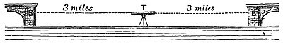
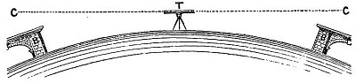

  
[Intangible Textual Heritage](../../index)  [Earth Mysteries](../index) 
[Index](index)  [Previous](za07)  [Next](za09) 

------------------------------------------------------------------------

[Buy this Book at
Amazon.com](https://www.amazon.com/exec/obidos/ASIN/0766149455/internetsacredte)

------------------------------------------------------------------------

  
*Zetetic Astronomy*, by 'Parallax' (pseud. Samuel Birley Rowbotham),
\[1881\], at Intangible Textual Heritage

------------------------------------------------------------------------

### EXPERIMENT 3.

A good theodolite was placed on the northern bank of the canal, midway
between Welney Bridge and the Old Bedford Bridge, which are fully six
miles apart, as shown in diagram, fig. 7. The line of sight from the
"levelled" theodolite fell

   
FIG. 7.

upon the points B, B, at an altitude, making allowance for refraction,
equal to that of the observer at T. Now the points B, B, being three
miles from T, would have been the square of three, or nine times 8
inches, or 6 feet below the line of sight, C, T, C, as seen in the
following diagram, fig. 8.

   
FIG. 8.

------------------------------------------------------------------------

[Next: Experiment 4](za09)
