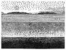

  
[Intangible Textual Heritage](../../index)  [Earth Mysteries](../index) 
[Index](index)  [Previous](za57)  [Next](za59) 

------------------------------------------------------------------------

[Buy this Book at
Amazon.com](https://www.amazon.com/exec/obidos/ASIN/0766149455/internetsacredte)

------------------------------------------------------------------------

  
*Zetetic Astronomy*, by 'Parallax' (pseud. Samuel Birley Rowbotham),
\[1881\], at Intangible Textual Heritage

------------------------------------------------------------------------

### TRANSMISSION OF LIGHT.

"The progressive transmission of light being
established, let us deduce from it our demonstration of the earth's
rotation. If the earth is immoveable we ought not to see the stars the
moment they arrive at the horizon or at the meridian, but only after the
time acquired for the rays they emit to reach us. If, on the contrary,
the earth turns, we ought to see the stars the moment they arrive,
either at the horizon or at the meridian; for in consequence of the
rotary motion, the eyes will fall into the line of the rays which had
set out some time before from the stars, and which now arrive at the
points of space traversed by our horizon. Now we do see the stars the
instant of their arrival. The proof of this is, that the culminations of
Mars,

p. 324

for instance, would be more or less advanced or
retarded according as that planet approached or receded from us, if we
did not see it the moment it arrived at the meridian, but no appearance
of the kind is noticed; the earth, therefore, must turn." [1](za59.htm#fn_137)

It is difficult to understand in what way the language of the above
paragraph can be applied to prove the motion of the earth that does not
equally apply to the proof of sidereal motion. The Newtonian
astronomers, however, felt the necessity for practical proof of their
leading assumptions; and hence have always been anxious to seize upon
whatever could, by any kind of treatment, be made to appear like an
argument in their favour.

In the above case they have been as premature and unfortunate as they
have notoriously been in connection with other phenomena.

------------------------------------------------------------------------

[Next: Precession of the Equinoxes](za59)
