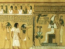

  
[Intangible Textual Heritage](../../index)  [Ancient Egypt](../index) 
[Index](index)  [Previous](ael15)  [Next](ael17) 

------------------------------------------------------------------------

  
*Ancient Egyptian Legends*, by M. A. Murray, \[1920\], at Intangible
Textual Heritage

------------------------------------------------------------------------

p. 117

### INDEX OF NAMES OF GODS

*Abtu-fish.*—A mythological fish which accompanies the Boat of Ra at
sunrise.

*Amemt.*—The mythical animal which devours the hearts of the wicked at
the Judgment of Osiris.

*Amon.*—God of Thebes. In and after the xviiith dynasty he became the
supreme deity of Egypt under the name of Amon-Ra.

*Ant-fish.*—A mythological fish which accompanies the Boat of Ra at
sunrise.

*Anubis.*—A jackal-headed deity who presided over the embalming of the
dead. He was said to be the illegitimate son of Osiris and Nephthys,
and, in the form of a dog, to have protected Isis in her wanderings.

*Apep.*—The enemy of Ra in the Duat.

*Astarte.*—A Syrian goddess, whose name is found occasionally in
Egyptian inscriptions.

*Atmu.*—An early name of the solar deity worshipped at Heliopolis. In
later times, the name of the setting sun.

*Bes.*—A bandy-legged dwarf with horns. God of music and pleasure, and
protector of children. Possibly also a god of birth.

*Besa.*—A spirit of the corn.

*Geb.*—The earth-god, father of Osiris.

*Harmakhis.*—Horus on the Horizon, i.e. the sun at its rising and
setting.

*Harpocrates.*—Horus the Child, son of Isis and Osiris.

*Hathor.*—Goddess of love and beauty; often identified with all the
other goddesses, including Sekhmet.

*Hekt.*—The frog-headed goddess of birth.

*Her-desuf.*—A form of Horus.

*Horakhti.*—The Horizon-Horus. The same as Harmakhis.

*Horus.*—The hawk-headed god is, properly speaking, the

p. 118

brother of Isis and Osiris; but is constantly confused with Horus the
Child, and is called Avenger or Protector of his Father.

*Isis.*—The greatest of Egyptian goddesses, wife of Osiris, and mother
of Harpocrates.

*Khepera.*—The rising sun, god of resurrection.

*Khnum.*—The ram-headed god of the cataract, who creates man upon the
potter's wheel.

*Khonsu.*—The moon-god at Thebes.

*Mehen.*—The serpent who protects Ra in the Duet.

*Mentu.*—God of war.

*Meskhent.*—Goddess of birth.

*Min.*—Father of gods and men. God of Koptos.

*Neith.*—Goddess of Saïs. Identified by the Greeks with Athena.

*Nekhbet.*—The vulture-goddess of Upper Egypt.

*Nephthys.*—Sister of Isis and Osiris.

*Nepra.*—A spirit of the corn.

*Nun.*—God of the primaeval waters.

*Nut.*—The sky-goddess, mother of Osiris.

*Osiris.*—One of the chief gods of Egypt. Murdered and torn to pieces by
his brother Set, re-vivified by Isis and Horus.

*Ra.*—The Sun-god, one of the chief gods of Egypt. Heliopolis (the On of
the Bible) was the principal centre of his worship.

*Sekhmet.*—The lioness-headed goddess of Memphis.

*Selk.*—The scorpion-goddess.

*Set.*—Brother and murderer of Osiris. Looked upon, in late times, as
the Author of Evil.

*Shu.*—Twin-brother of Tefnut. He holds up the sky above the earth.

*Sokar.*—The hawk-headed god of the dead. When fused with Ptah
(Ptah-Sokar) he appears in the form of a misshapen dwarf, and is then
looked upon as a god of resurrection.

*Tatanen.*—An obscure god, generally fused with Ptah of Memphis as
Ptah-Tatanen.

*Ta-urt.*—The hippopotamus goddess of birth.

*Tefnut.*—Lioness-headed. Twin-sister of Shu. The two form the
constellation Gemini.

*Tepu-yn.*—A spirit of the corn,

p. 119

*Thoth.*—The ibis-headed god of all learning and magic. Chief centre of
worship Khemennu or Hermopolis, now called Eshmunen.

*Uazet.*—Goddess of Lower Egypt.

*Up-uaut.*—The jackal-god of Siut.

PRINTED BY

HAZELL, WATSON AND VINEY, LD.,

LONDON AND AYLESBURY,

ENGLAND.

------------------------------------------------------------------------

[Next: Advertisements](ael17)
