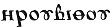
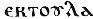
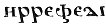

  
[Intangible Textual Heritage](../../index)  [Egyptian](../index) 
[Index](index)  [Previous](dmp49)  [Next](dmp51) 

------------------------------------------------------------------------

### VERSO COL. XVIII.

\(1\) '  (2)   (3)  .

\(4\) 'Reveal thyself to me, god N., (5) and speak to me concerning that
which I shall ask thee, (6) truthfully, without telling me (7)
falsehood.' Saffron, 2 (measures), (8) stibium of Koptos, 2 (measures),
(9) pound together with blood of a lizard, (10) make into a ball, and
rub it with milk (11) of one who has born a male child. Put (it) in his
right eye; you make invocation (?) to him (?) (13) before any lamp or
the 'Shoulder' constellation in the evening.

------------------------------------------------------------------------

[Next: Verso Col. XIX](dmp51)
