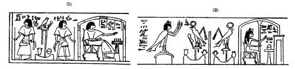
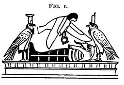
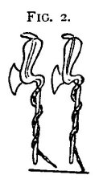
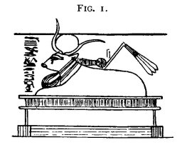
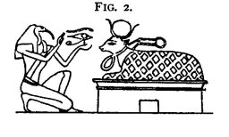
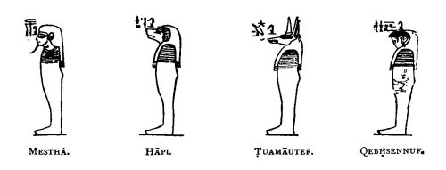
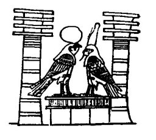
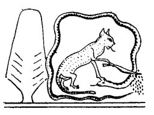

  
[Intangible Textual Heritage](../../index)  [Egypt](../index) 
[Index](index)  [Previous](ebod17)  [Next](ebod19) 

------------------------------------------------------------------------

# PLATES VII.-X.

Vignette: The vignette of these plates, forming one composition, runs
along the top of the text. The subjects are:-

Plate VII. i. Ani and his wife in the *seh* hall;\[1\] he is moving a
piece on a draught-board \[2\] (to illustrate lines 3 and 4 of the
text).

2\. The souls of Ani and his wife standing upon a pylon-shaped building.
The hieroglyphics by the side of Ani's soul read *ba en Ausar*, "the
soul of Osiris."

\[1. In the papyrus of Hunefer the first scene in this vignette is
composed of Amenta, and the signs \#\#\# and \#\#\#, emblematic of food
and drink. On each side is a figure of the deceased, but that on the
left faces to the left and that on the right faces to the right. (1)
Compare also the variant from the papyrus of Mut-em-uaa. (2)

2\. See page 281, note i.\]

{p. 277}

3\. A table of offerings, upon which are laid a libation vase, plants,
and lotus flowers\[1\].

4\. Two lions seated back to back and supporting the horizon, over which
extends the sky. The lion on the right is called *Sef*, *i.e.*,
"Yesterday," and that on the left *Tuau*, *i.e.*, "Tomorrow" (to
illustrate lines 13-16).

5\. The *bennu* bird,\[2\] and a table of offerings (to illustrate lines
26-30).

6\. The mummy of Ani lying on a bier within a funereal shrine; the head
and foot are Nephthys and Isis in the form of hawks. Beneath the bier
are vases painted to imitate variegated marble or glass,\[3\] a funereal
box, Ani's palette, etc.\[4\]

Plate VIII. I.\[5\] The god Heh "Millions of years," wearing the emblem
of "years" ( upon his head, and holding a similar object in his right
hand; he is

\[1. In many papyri a figure of the deceased, kneeling in adoration
before the lions supporting the horizon, takes the place of the table of
offerings. Here the artist probably intended to represent the souls of
Ani and his wife making these offerings to the lion-gods.

2 The name of the sanctuary in which the *bennu* bird was worshipped was
Het-bennu. Greek writers called this bird the phoenix, and the Egyptians
considered it as a symbol of Osiris. In a text quoted by Brugsch
(*Wörterbuch*, p. 397), it is said to have created itself. The *bennu*
was also worshipped at Diospolis Parva in Upper Egypt; and it was
asserted that the thigh of Osiris was preserved in one of its
sanctuaries, and his phallus in another.

3 For examples of such vases see Nos. 4875, 4879, 4887, 9529, in the
Fourth Egyptian Room.

4 In many papyri the soul of the deceased in the form of a human-headed
bird is seen hovering over the dead body. (Fig. 1.)

6 The papyrus of Ani omits the two uræi which are referred to in lines
33-36. According to the papyrus of Hunefer (British Museum papyrus No.
9901) they represent the North and the South. (Fig. 2.)

\]

{p. 278}

kneeling and extends his left hand over a pool (?) in which is an eye
(to illustrate line 46).

2\. The god *Uatch-ura*, "Great Green Water," with each hand extended
over a pool; that under his right hand is called *She en hesmen*, "Pool
of Natron," and that under his left hand *She en Maaat*, "Pool of Nitre
*or* Salt" (to illustrate lines 47-50).

3\. A pylon with doors, called *Re-stau*, "Gate of the funereal
passages" (to illustrate lines 56-58).

4\. The *utchat* facing to the left above a pylon (to illustrate line
73).

5\. The cow (Fig. 1) *Mehurt maat Ra*, "Mehurt, the eye of Ra," with a
flail and having on her head a disk and horns and round her neck the
collar and menat (to illustrate lines 75-79).\[1\]

6\. A funereal chest from which emerge the head of Ra, and his two arms
and hands, each holding the emblem of life. The chest, which is called
*aat Abtu*, "the district of Abydos," or the "burial place of the East,"
has upon its side figures of the four children of

\[1. In the papyrus of Hunefer (British Museum papyrus No. 9902) the god
Thoth is represented offering the *utchat* to the *Mehurt* cow. (Fig.
2.)

\]

{p. 279\]

Horus who protect the intestines of Osiris or the deceased. On the right
stand Tuamautef and Qebhsennuf, and on the left Mestha and Hapi (to
illustrate lines 82, 83).

Plate IX. 1. Figures of three gods who, together with Mestha, Hapi,
Tuamautef, and Qebhsennuf, are the "seven shining ones" referred to, in
line 99. Their names are: Maa-atef-f, Kheri-beq-f, and Heru-khent-maati.

2\. The god Anpu (Anubis), jackal-headed.

3\. Figures of seven gods, whose names are Netchehnetcheh, Aaqetqet,
Khenti-heh-f\[1\], Ami-unnut-f\[2\], Tesher-maa,\[3\],
Bes-maa-em-kerh,\[4\] and An-em-hru\[5\] (to illustrate lines 99-106).

4\. The soul of Ra, and the soul of Osiris in the form of a human-headed
bird wearing the crown conversing in Tattu a scene of very rare
occurrence, and illustrating lines 111, 112.

\[1. *I.e.*, "He dwelleth in his flame."

2\. *I.e.*, " He who is in his hour."

3\. *I.e.*, " Red of both eyes."

4\. *I.e.*, "Flame seeing in the night."

5\. *I.e.*, " Bringing by day."\]

{p. 280}

Plate X. I. The Cat, *i.e.*, the Sun, which dwelleth by the persea tree
in Heliopolis, cutting off the head of the serpent Apepi, emblematic of
his enemies.\[1\]

2\. Three seated deities holding knives. They are probably Sau, Horus of
Sekhem, and Nefer-Tmu.

3\. Ani and his wife Thuthu, who holds a sistrum, kneeling in adoration
before the god Khepera, beetle-headed, who is seated in the boat of the
rising sun (to illustrate lines 116 ff.).

4\. Two apes, emblematic of Isis and Nephthys (to illustrate lines 124,
125).

5\. The god Tmu, seated within the Sun-disk in the boat of the setting
sun, facing a table of offerings.

6\. The god Rehu, in the form of a lion (to illustrate line 133).

7\. The serpent Uatchit, the lady of flame, a symbol of the eye of Ra,
coiled round a lotus flower. Above is the emblem of fire.

Text: \[Chapter XVII.\] (1.) HERE BEGIN THE PRAISES AND GLORIFYINGS\[2\]
OF COMING OUT FROM AND GOING INTO (2) THE GLORIOUS NETER-KHERT IN THE
BEAUTIFUL AMENTA, OF COMING OUT BY DAY\[3\] IN ALL THE FORMS OF
EXISTENCE WHICH

\[1. Compare the following variant from a papyrus in Dublin. In the
papyrus of Hunefer, before the scene of the Cat cutting off Apepi's
head, is one in which the deceased is represented kneeling in adoration
before five ram-headed gods, whose names are Ra, Shu, Tefnut, Seb and
Ba-\[neb\]-Tattu.

2\. Pierret renders, résurrection des mânes." See *Le Livre des Morts*,
p. 53.

3\. Some copies read, "to be with the followers of Osiris, and to feed
upon the food of Un-nefer, to come forth by day"; and others, "may I
drink water at the sources of the streams, and be among the followers of
Un-nefer; may I see the disk every morning." For the texts, see Naville,
*Todtenbuch*, Bd. II., Bl. 29.\]

{p. 281}

PLEASE HIM (*i.e.*, THE DECEASED), OF PLAYING AT DRAUGHTS' AND SITTING
IN THE (3) SEH HALL, AND OF COMING FORTH AS A LIVING SOUL. Behold
Osiris, the scribe Ani, after (4) he hath come to his haven \[of rest\].
That which hath been done upon earth \[by Ani\] being blessed, all (5)
the words of the god Tmu come to pass. "I am the god Tmu in \[my\]
rising;\[2\] I am the only One. I came into existence in Nu. (6) I am Ra
who rose in the beginning. \[He hath ruled that which he made.\]\[3\]"

\(7\) Who then is this? It is Ra who rose for the first time in the city
of (8) Suten-henen\[4\] \[crowned\]\[5\] as a king in \[his\]
rising.\[6\] The pillars of Shu\[7\] were not as yet created, when he
was upon the (9) high place of him who is in Khemennu.\[8\]

"I am the great god who gave birth to himself, even Nu, (10) \[who\]
created his name *Paut Neteru*\[9\] as god."

Who then (11) is this? It is Ra, the creator of the name\[s\] of his
limbs, which came into being (12) in the form of the gods in the train
of Ra.

"I am he who is not driven back among the gods."

\[1. For accounts of the way in which draughts were played by the
Egyptians, see Birch, in *Revue Archéologique*, 1864, p. 56 ff.; Birch,
in *Aeg. Zeitschrift*, 1866, p. 97; Birch, in Trans. Boy. Son
Literature, New Series, vol. ix., p. 256; and Falkner, *Oriental Games*,
London, 1892. The draught-board of the ancient Egyptians is often a
rectangular wooden box, the top divided into squares, containing a
drawer in which the men are kept (British Museum, No. 21,576).
Draught-boards were also made of blue glazed *faïence*, and bone or
ivory (British Museum, No. 21,577). The draughtsmen n are of wood, bone,
ivory, glazed *faïence*, or stone, and have at times the heads of lions
1) (British Museum, Nos. 13,417, 21,580, 21,581); jackals (British
Museum, Nos. 604*b*, 24,660-66); and of the god Bes (British Museum,
Nos. 6413*c*, 24,667-75). No. 6414*a* is inscribed with the prenomen of
Necho II.

2, *I.e.*, the Sun-god when he sets and rises.

3\. Supplied from the Papyrus of Nebseni. See British Museum papyrus No.
9900; Naville, *Todtenbuch*, Bd. II., Pl. xxxi.

4 See *supra*, p. 273, note 3.

5\. Adding \#\#\# or \#\#\# from the variant readings given by Naville.

6\. Some papyri read *Unnu*; on this town, see Brugsch, *Dict. Géog.*,
p. 146.

7\. Shu was the son of Ra and Hathor and the twin-brother of Tefnut. He
typified the sunlight, and separated the earth from the sky, which he
established and supported. For a drawing of Shu and his four supports,
see Lanzone, *Dizionario*, tav. 385.

8\. See Brugsch, *Dict. Géog.*, p. 749.

9\. *I.e.*, " substance of the gods."\]

{p. 282}

\(13\) Who then is this? It is Tmu in his disk, or (as others say), It
is Ra in (14) his rising in the eastern horizon of heaven.

"I am Yesterday; I know (15) Tomorrow."

Who then is this? Yesterday is Osiris, and (16) Tomorrow is Ra, on the
day when he shall destroy the (17) enemies of Neb-er-tcher, and when he
shall stablish as prince and ruler (18) his son Horus, or (as others
say), on the day when we commemorate the festival (19) of the meeting of
the dead Osiris with his father Ra, and when the battle of the (20) gods
was fought in which Osiris, lord of Amentet, was the leader.

What then is this? (21) It is Amentet, \[that is to say\] the creation
of the souls of the gods when Osiris was leader in Set-Amentet; or (22)
(as others say), Amentet is that which Ra hath given unto me; when any
god cometh, he doth arise and (23) doeth battle for it.

"I know the god who dwelleth therein."

\(24\) Who then is this? It is Osiris," or (as others say), Ra is his
name, even Ra (25) the self-created.

"I am the *bennu*\[1\] bird (26) which is in Annu, and I am the keeper
of the volume of the book of things\[2\] which are and of things which
shall be."

Who (27) then is this? It is Osiris, or (as others say), It is his dead
body, or (as others say), (28) It is his filth. The things which are are
and the things which shall be are his dead body; or (as others say),
(29) They are eternity and everlastingness. Eternity is the day, and
everlastingness (30) is the night.

"I am the god Amsu\[3\] in his coming-forth; may his (31) two plumes be
set upon my head."

\[1. See above, p. 277, note 2.

2\. Or, "I am he that presideth over the arrangement (or ordering) of
things," etc. Birch renders it, "The Creator of beings and existences,"
and Pierret, "La loi de 1'existence et des êtres." In a hymn Ra is
called *neb enti*, "lord of things which are," and *ari enti*, "maker of
things which are," and *ari unenet*, "maker of things which shall be."
See Grébaut, *Hymne à Ammon-Ra*, pp. 5, 16, 27, who, however, believes
to mean inanimate objects; see p. 130.

3\. The name of this god was first read Khem, and then Min, but it has
been proved (*Aeg. Zeitschriff*, 1877, p. 98, and *Trans. Soc. Bibl.
Arch.*, Vol. VIII., p. 204, note 2) that the correct {footnote page 283}
reading is Amsu (compare the variants in Naville, *Todtenbuch*, Bd. II.,
Bl. 41). This god was associated with Amen-Ra, and represented the power
of reproduction (see Pierret, *Panthéon*, p. 39; and Lanzone,
*Dizionario*, p. 935). The seat of his worship was Apu, the Panopolis of
the Greeks, and the Akhmîm of Arabic writers. For the forms of the name
of the town, see Brugsch, *Dict. Géog.*, p. 19. Figures of Amsu, in
bronze and *faïence*, are common, and good examples are Nos. 43, 44, 45,
46, 47*a*, and 13,520 in the Third Egyptian Room.\]

{p. 283}

Who then is this? Amsu is Horus, the (32) avenger of his father, and his
coming-forth is his birth. The (33) plumes upon his head are Isis and
Nephthys when they go forth to set themselves (34) there, even as his
protectors,\[1\] and they provide that which (35) his head lacketh,\[2\]
or (as others say), They are the two exceeding great uræi which are upon
the head of their (36) father Tmu, or (as others say), His two eyes are
the two plumes.

\(37\) "Osiris Ani, the scribe of all the holy offerings, riseth up in
his place in triumph; he cometh into (38) his city."\[3\]

What then is this? It is the horizon of his father Tmu.

\(39\) "1 have made an end of my shortcomings, and I have put away my
faults."

What then (40) is this? It is the cutting off of the corruptible\[4\] in
the body of Osiris, the scribe Ani, (41) triumphant before all the gods;
and all his faults are driven out.

\(42\) What then is this? It is the purification \[of Osiris\] on the
day of his birth.

\(43\) "I am purified in my exceeding great double nest\[5\] which is in
Suten henen, (44) on the day of the offerings of the followers of the
great god who is therein."

\(45\) What then is this? "Millions of years" is the name of the one

\[1. Or "grandmothers." Isis was the " greater tcherti," and Nephthys
the "lesser tcherti." On the word, see Brugsch, *Wörterbuch*, Supp., p.
11335.

2\. The chief variant readings are \#\#\#.

3\. British Museum papyrus No. 9900 has, "I rise up in my land, I come
into (or from) mine eye." The papyrus of Kenna at Leyden has the same
reading as that of Ani.

4\. The papyrus of Kenna has "the hind-parts."

5\. The chief variants are \#\#\# and \#\#\#. See Naville, *Todtenbuch*,
Bd. II., Pl. xvii.\]

{p. 284}

\[nest\], (46) "Green Lake"\[1\] is the name of the other; a pool of
natron, and a pool of nitre (47); or (as others say), "The Traverser of
Millions of Years" is the name of the one, "Great Green Lake" (48) is
the name of the other; or (as others say), " The Begetter of Millions of
Years" is the name of the one, "Green Lake" is (49) the name of the
other. Now as concerning the great god who is in it, it is Ra himself.
(50)

"I pass over the way, I know the head\[2\] of the Pool of Maata."\[3\]

\(51\) What then is this? It is Re-stau;\[4\] that is to say, it is the
underworld on the (52) south of Naarut-f,\[5\] and it is the northern
door\[6\] of the tomb.

Now as concerning (53) She-Maaat,\[7\] it is Abtu; or (as others say),
It is the road by which his (54) father Tmu travelleth when he goeth to
Sekhet-Aaru,\[8\] (55) which bringeth forth the food and nourishment of
the gods behind the shrine. (56) Now the Gate of Sert\[9\] is the gate
of the pillars of Shu, (57) the northern gate of the underworld; or (as
others say), It is the two leaves of the door through (58) which the god
Tmu passeth when he goeth forth in the eastern horizon of heaven.

\(59\) "O ye gods who are in the presence\[10\] (of Osiris), grant me
your arms, for I am the god (60) who shall come into being among you."

\[1. According to Brugsch (*Dict. Géog.*, p. 179), "Green Lake" is the
name of one of the two sacred lakes of Heracleopolis Magna.

2\. Literally "heads."

3\. For the locality of this name in Egypt, see Brugsch, *Dict. Géog.*,
p. 248.

4\. *I.e.*, " the door of the passages of the tomb."

5\. The chief variants in Naville are \#\#\#.

6\. Variants \#\#\#.

7\. *I.e.*, the "Pool of Double Truth."

8\. After the name Sekhet-Aaru, British Museum papyrus No. 9900 has "I
come forth to the land of the . . . . . . . I come forth from the gate
Ser." "What then is this?" The papyrus of Ani omits this passage.

9 According to Brugsch (*Die biblischen sieben jahre der Hungersnoth*,
p. 13) should be read *T'eser*. In 1867 Dr. Birch translated, "I go from
the Gate of the Taser" (Bunsen, *Egypt's Place*, Vol. V., p. 174).

10\. A variant has "who are in his following." See Naville,
*Todtenbuch*, Bd. II., Pl. xlix.\]

{p. 285}

What then is this? It is the drops of blood (61) which fell from Ra when
he went forth (62) to cut himself. They sprang into being as the gods Hu
and Sa, who are in the (63) following of Ra and who accompany Tmu (64)
daily and every day.

"I, Osiris, Ani (65) the scribe, triumphant, have filled up for thee the
*utchat*\[1\] after it was darkened (66)\[2\] on the day of the combat
of the Two Fighters."\[3\]

What then (67) is this? It is the day on which Horus fought with (68)
Set, who cast filth in the face of Horus, and when Horus destroyed the
(69) powers of Set. Thoth did this with his own hand.

\(70\) "I lift the hair\[-cloud\]\[4\] when there are storms in the
sky."

What then is this? (71) It is the right eye of Ra, which raged against
\[Set\] when (72) he sent it forth. Thoth raiseth up the hair\[-cloud\],
and bringeth the eye (73) alive, and whole, and sound, and without
defect to \[its\] lord; or (as others say), It is the eye of Ra when it
is sick and when it (74) weepeth for its fellow eye; then Thoth standeth
up to cleanse it.

\(75\) "I behold Ra who was born yesterday from the (76) buttocks\[5\]
of the cow Meh-urt;\[6\] his strength is my strength, and my strength is
his strength."

What then (77) is this? It is the water of heaven, or (as others say),
(78) It is the image of the eye of Ra in the morning at his daily birth.
(79) Meh-urt is the eye of Ra. Therefore Osiris, the (80) scribe Ani,
triumphant, \[is\] a great one among the gods (81) who are in the train
of Horus. The words are\] spoken for him that loveth his lord.\[7\]

\[1. *I.e.*, the eye of the Sun.

2\. Some variants give "pierced."

3\. Rehui was a name given in the first instance to Horus and Set, but
subsequently it was applied to any two combatants (see the passages
quoted by Brugsch, *Wörterbuch*, Suppl., p. 734). British Museum papyrus
No. 10,184 (Sallier IV.), states that the battle between Horus and Set
took place on the 26th day of the month of Thoth, *i.e.*, October (see
Chabas, *Le Calendrier*, p. 28).

4\. The scribe has omitted the words *em utchat*, "from the eye of the
sun." The word *shen* is a name for the clouds which cover the eye of
the sun, and which are in appearance like hair. Brugsch in his
*Wörterbuch* (Suppl.), p. 1193, gives the word as meaning "tempest."

5\. The papyrus has \#\#\#.

6\. For figures of this goddess, see Lanzone, *Dizionario*, plate 131.

7\. The meaning of this passage is doubtful. Birch renders, "one of the
gods who belong to Horus, whose words exceed the wish of his Lord"; and
Pierret, "un de ces dieux qui suivent Horus, et parlent selon la volonté
de leur seigneur."\]

{p. 286}

\(82\) What then is this? \[*i.e.*, who are these gods?\] Mestha,
Hapi\[1\] Tuamautef, and Qebhsennuf.

\(83\) "Homage to you, O ye lords of right and truth, and ye holy ones
who \[stand\] behind Osiris, who utterly do away with (84) sins and
crime, and \[ye\] who are in the following of the goddess
Hetep-se(85)-khus, grant that I may come unto you. Destroy ye all the
faults which (86) are within me, even as ye did for the seven Shining
Ones (87) who are among the followers of their lord Sepa.\[1\] (88)
Anubis appointed their place on the day \[when was said\], 'Come
therefore thither.'"

What then (89) is this? These lords of right and truth are Thoth and
(90) Astes, lord of Amenta. The holy ones who stand behind Osiris, even
Mestha, (91) Hapi, Tuamautef, and Qebhsennuf, are they who are (92)
behind the Thigh\[2\] in the northern sky. They who do away with (93)
sins and crime and who are in the following of the goddess Hetep-se-khus
(94) are the god Sebek in the waters. The goddess Hetep-se-khus is the
eye of (95) Ra, or (as others say), It is the flame which followeth
after Osiris to burn up (96) the souls of his foes. As concerning all
the faults which are (97) in Osiris, the scribe of the holy offerings of
all the gods, Ani, triumphant, \[they are all that he hath done against
the lords of eternity\]\[3\] since he came forth (98) from his mother's
womb. As concerning (99) the seven Shining Ones, even Mestha, Hapi,
Tuamautef, Qebhsennuf, (100) Maa-atef-f, Kheri-beq-f, and
Horus-Khenti-maa, Anubis appointed (101) them protectors of the body of
Osiris, or (as others say), (102) \[set them\] behind the place of
purification of Osiris; or (as others say), Those seven glorious ones
are (103) Netcheh-netcheh, Aqet-qet,
An-erta-nef-bes-f-khenti-heh-f,\[4\] (104) Aq-her-unnut-f,\[5\]
Tesher-maa-ammi (105) -het-Anes,\[6\]

\[1. British Museum papyrus No. 10,477 reads \#\#\# which agrees with
many of the variants given in Naville, *Todtenbuch*, Bd. II., P1. liii.
The papyrus of Nebseni agrees with that of Ani; No. 19,471 has the
curious reading, \#\#\#.

2\. The Egyptian name for the constellation of the Great Bear. See
Brugsch, *Astronomische und Astrologische Inschriften*, p. 123.

3\. Some such words as have been omitted. See Naville, *Todtenbuch*, Bd.
IL, Pl. lv.

4\. *I.e.*, "He doth not give his flame, he dwelleth in the fire."

5\. *I.e.*, "He goeth in at his hour."

6\. *I.e.*, "He that hath two red eyes, the dweller in Het-Anes."
According to Brugsch (Dict. Géog., p. 64), Het-Anes, *i.e.*, the "house
of cloth," was a district belonging to the temple of Suten-henen or
Heracleopolis in Upper Egypt.\]

{p. 287}

Ubes-hra-per-em-khet khet,\[l\] and Maa (106)
-em-qerh-an-nef-em-hru.\[2\] The chief of the holy ones (107) who
minister in his chamber is Horus, the avenger of his father. As to the
day (108) \[upon which was said\] " Come therefore thither," it
concerneth the words, "Come (109) then thither," which Ra spake unto
Osiris. Lo, may this be decreed for me in Amentet.

"I am the soul which dwelleth in the two (110) *tchafi*."

What then is this? It is Osiris \[when\] he goeth into Tattu (111) and
findeth there the soul of Ra; there the one god (112) embraceth the
other, and souls spring into being within the two *tchafi*.\[3\]

\["I am the Cat which fought (?) by the Persea tree hard by in Annu, on
the night when the foes of Neb-er-tcher were destroyed."\]

What then is this? The male cat is Ra himself, and he is called
Maau\[4\] by reason of the speech of the god Sa \[who said\] concerning
him: "He is like (*maau*) unto that which he hath made, and his name
became Maau"; or (as others say), It is Shu who maketh over the
possessions of Seb to Osiris. As to the fight (?) by the Persea tree
hard by, in Annu, it concerneth the children of impotent revolt when
justice is wrought on them for what they have done. As to \[the words\]
"that night of the battle," they concern the inroad \[of the children of
impotent revolt\] into the eastern part of heaven, whereupon there arose
a battle in heaven and in all the earth.

"O thou who art in the egg (i.e., Ra), who shinest from thy disk and
risest in thy horizon, and dost shine like gold above the sky, like unto
whom there is none among the gods, who sailest over the pillars of Shu
(*i.e.*, the ether), who givest blasts of fire from thy mouth, \[who
makest the two lands bright with thy radiance, deliver\] the faithful
worshippers from the god whose forms are hidden, whose eyebrows are like
unto the two arms of the balance on the night of the reckoning of
destruction."

\[1. *I.e.*, "Blazing-face coming forth, going back."

2 *I.e.*, "The one who seeth by night, and leadeth by day."

3 This reading differs from that of any other papyrus of this period.
After the words, "spring into being within the two *tchafi*," the
papyrus of Nebseni has, "It is Horus, the avenger of his father, and
Horus-khenti-en-maa," or (as others say), "'the two souls within the
tchafi' are the soul of Ra \[and\] the soul of Osiris, \[or\] the soul
which is in Shu and the soul which is in Tefnut, that is, the two souls
which are in Tattu." It appears that the scribe of the Ani papyrus has
here accidentally omitted a long section; the text is therefore supplied
within brackets from the Nebseni papyrus, plate xiv., 1. 16 ff.

4\. Note the play upon the words *maau*, "cat," and *maau*, "like."\]

{p. 288}

Who then is this? It is An-a-f, the god who bringeth his arm. As
concerning \[the words\] "that night of the reckoning of destruction,"
it is the night of the burning of the damned, and of the overthrow of
the wicked at \[the sacred\] block, and of the slaughter of souls.

Who then is this? It is Nemu, the headsman of Osiris; or (as others
say), It is Apep when he riseth up with one head bearing *maat* (*i.e.*,
right and truth) \[upon it\]; or (as others say), It is Horus when he
riseth up with two heads, whereof the one beareth *maat* and the other
wickedness. He bestoweth wickedness on him that worketh wickedness, and
*maat* on him that followeth after righteousness and truth; or (as
others say), It is the great Horus who dwelleth in \[Se\] khem; or (as
others say), It is Thoth; or (as others say), It is Nefer-Tmu, \[or\]
Sept,\[1\] who doth thwart the course of the foes of Neb-er-tcher.

"Deliver me from the Watchers who bear slaughtering knives, and who have
cruel fingers,\[2\] and who slay those who are in the following of
Osiris. May they never overcome me, may I never fall under their
knives."

"What then is this? It is Anubis, and it is Horus in the form of
Khent-en-maa; or (as others say), It is the Divine Rulers who thwart the
works of their \[weapons\]; it is the chiefs of the *sheniu* chamber.

"May their knives never get the mastery over me, may I never fall under
their instruments of cruelty, for I know their names, and I know the
being Matchet\[3\] Who is among them in the house of Osiris, shooting
rays of light from \[his\] eye, but he himself is unseen. He goeth round
about heaven robed in the flame of his mouth, commanding Hapi, but
remaining himself unseen. May I be strong upon earth before Ra, may I
come happily into haven in the presence of Osiris. Let not your
offerings be hurtful to me, O ye who preside over your altars, for I am
among those who follow after Neb-er-tcher according to the writings of
Khepera. I fly as a hawk, I cackle as a goose; I ever slay, even as the
serpent goddess Nehebka."

What then is this? They who preside at the altars are the similitude of
the eye of Ra and the similitude of the eye of Horus.

"O Ra-Tmu, lord of the Great House, prince, life, strength and health of
all the gods, deliver thou \[me\] from the god whose face is like unto
that of a dog, whose brows are as those of a man, and who feedeth upon
the dead, who watcheth

\[1. Many papyri read, "Nefer-Tmu, son of Bast, and the *tchatcha*."

2\. Or instruments of death.

3\. *I.e.*, the "Oppressor."\]

{p. 289}

at the Bight of the Fiery Lake, and who devoureth the bodies of the dead
and swalloweth hearts, and who shooteth forth filth, but he himself
remaineth unseen."

Who then is this? "Devourer for millions of years" is his name, and he
dwelleth in the Lake of Unt.\[1\] As concerning the Fiery Lake, it is
that which is in Anrutf, hard by the *Shenit* chamber. The unclean man
who would walk thereover doth fall down among the knives; or (as others
say), His name is "Mathes,"\[2\] and he is the watcher of the door of
Amenta; or (as others say), His name is "Heri-sep-f."

"Hail, Lord of terror, chief of the lands of the North and South, lord
of the red glow, who preparest the slaughter-block, and who dost feed
upon the inward parts!"

Who then is this? The guardian of the Bight of Amenta.

What then is this? It is the heart of Osiris, which is the devourer of
all slaughtered things. The *urerit* crown hath been given unto him with
swellings of the heart as lord of Suten-henen.

What then is this? He to whom hath been given the *urerit* crown with
swellings of-the heart as lord of Suten-henen is Osiris. He was bidden
to rule among the gods on the day of the union of earth with earth in
the presence of Neb-er-tcher.

What then is this? He that was bidden to rule among the gods is
\[Horus\] the son of Isis, who was appointed to rule in the place of his
father Osiris. As to the day of the union of earth with earth, it is the
mingling of earth with earth in the coffin of Osiris, the Soul that
liveth in Suten-henen, the giver of meat and drink, the destroyer of
wrong, and the guide of the everlasting paths.

Who then is this? It is Ra himself.

"Deliver thou \[me\] from the great god who carrieth away souls, and who
devoureth filth and eateth dirt, the guardian of the darkness \[who
himself " liveth\] in the light. They who are in misery fear him."

As concerning the souls within the (113) *tchafi* \[they are those which
are\] with the god who carrieth away the soul, who eateth hearts, and
who feedeth (114) upon offal, the guardian of the darkness who is within
the *seker* boat; they who live in (115) crime fear him.

Who then is this? It is Suti, or (as others say), It is Smam-ur,\[3\]
(116) the soul of Seb.

"Hail, Khepera in thy boat, the twofold company of the gods is thy body.
Deliver thou Osiris (117) Ani, triumphant, from the watchers who give
judgment,

\[1. Reading *se en Unt*.

2 The one with a knife.

3 *I.e.*, Great Slayer.\]

{p. 290}

who have been appointed by Neb-er(118)-tcher to protect him and to
fasten the fetters on his foes, and who slaughter in the shambles (119);
there is no escape from their grasp. May they never stab me with their
knives, (120) may I never fall helpless in their chambers of torture.
(121) Never have the things which the gods hate been done by me, for I
am pure within the Mesqet. (122) Cakes of saffron have been brought unto
him in Tanenet."

Who then is this? (123) It is Khepera in his boat. It is Ra himself. The
watchers (124) who give judgment are the apes Isis and Nephthys. The
things which the gods hate (125) are wickedness and falsehood; and he
who passeth through the place of purification within the Mesqet is
Anubis, who is (126) behind the chest which holdeth the inward parts of
Osiris.

He to whom saffron cakes have been brought in (127) Tanenet is Osiris;
or (as others say), The saffron cakes (128) in Tanenet are heaven and
earth, or (as others say), They are Shu, strengthener of the two lands
in (129) Suten-henen. The saffron cakes are the eye of Horus; and
Tanenet is the grave (110) of Osiris.

Tmu hath built thy house, and the two-fold Lion-god hath founded thy
habitation; (131) lo! drugs are brought, and Horus purifieth and Set
strengtheneth, and Set purifieth and Horus strengtheneth.

\(132\) "The Osiris, the scribe Ani, triumphant before Osiris, hath come
into the land, and hath possessed it with his feet. He is Tmu, and he is
in the city."

\(133\) "Turn thou back, O Rehu, whose mouth shineth, whose head moveth,
turn thou back from before his strength"; or (as others say), Turn thou
back from him who keepeth watch (134) and is unseen. "The Osiris Ani is
safely guarded. He is Isis, and he is found (135) with \[her\] hair
spread over him. I shake it out over his brow. He was conceived in Isis
and begotten in (136) Nephthys; and they cut off from him the things
which should be cut off."

Fear followeth after thee, terror is upon thine (137) arms. Thou art
embraced for millions of years in the arms \[of the nations\]; mortals
go round about thee. Thou smitest down the mediators of thy (138) foes,
and thou seizest the arms of the powers of darkness. The two sisters
(*i.e.*, Isis and Nephthys) are given to thee for thy delight. (139)
Thou hast created that which is in Kheraba, and that which is in Annu.
Every god feareth thee, for thou art exceeding great and terrible; thou
\[avengest\] every (140) god on the man that curseth him, and thou
shootest out arrows . . . . . . . . Thou livest according to thy will;
thou art Uatchit, the Lady of Flame. Evil cometh (141) among those who
set themselves up against thee.

{p. 291}

What then is this? The hidden in form, granted of Menhu, (142) is the
name of the tomb. He seeth \[what is\] in \[his\] hand, is the name of
the shrine, or (143) (as others say), the name of the block. Now he
whose mouth shineth and whose head moveth is (144) a limb of Osiris, or
(as others say), of Ra. Thou spreadest thy hair and I shake it out over
his brow (145) is spoken concerning Isis, who hideth in her hair and
draweth her hair over her. Uatchi, the Lady of Flames, is the eye of
Ra.\[1\]

------------------------------------------------------------------------

[Next: Plates XI. and XII.](ebod19)
