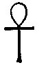
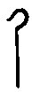
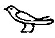

  
[Intangible Textual Heritage](../../index)  [Egypt](../index)  [EHH
Index](../ehh)  [Index](index)  [Previous](ehh19)  [Next](ehh21) 

------------------------------------------------------------------------

p. 158

# CHAPTER XI.

## SIXTH DIVISION OF THE TUAT.

### II. KINGDOM OF OSIRIS ACCORDING TO THE BOOK OF GATES.

THE Boat of AFU-RA, having passed through the first five DIVISIONS of
the Tuat, now, according to the BOOK OF GATES, arrives near the southern
part of the Delta, and near the kingdom of Osiris, lord of Mendes and
Busiris. Before, however, the god can enter it, he must pass through the
Gate of the SIXTH DIVISION, which is called NEBT-AHA, and which is
guarded by the monster serpent SET-EM-MAAT-F. In the Gate or close to
it, is the JUDGMENT HALL of OSIRIS, and it is tolerably certain that no
soul entered his kingdom without being weighed in the balance of the
god. The scene in which the Hall is depicted is of great interest, for
it is different in many important particulars from the representations
of the Judgment which we find on papyri, even in those which belong to
the period of the XVIIIth and XIXth Dynasties. All the texts which
describe it are written in hieroglyphics, but in many of them the
hieroglyphics have, as Champollion pointed

p. 159

 

 [  
Click to view](img/15900.jpg)  
Nebseni being weighed against his heart.

 

out, special and very unusual values, and the title "enigmatic writing"
given to them by Goodwin is appropriate. In the ordinary Judgment Scenes
we find that the heart of the deceased is weighed in the balance against
the feather symbolic of Maat or righteousness, that the operation of
weighing is carried out by Thoth and Anubis in the presence of the great
gods, the owner of the heart himself sometimes looking on, that the gods
accept and ratify the verdict of Thoth, and that the deceased is then
led into the presence of Osiris by Horus. Sometimes the heart of the
deceased is weighed against his whole body, as in the Papyrus of
Nebseni, and at other times the pans of the scales only contain weights.
In the scene before us the arrangement is quite different. Osiris is
seated on a chair of state, and wears the crowns of the South and North
united; in Nebseni being weighed against his heart.

 

 [  
Click to view](img/15901.jpg)  
The Scales of Osiris, with weights.

 

p. 160

his hands are the symbols of "life," 
 and "rule," 
. His chair stands on a raised platform, on the nine
steps of which stand the nine gods who form his company; beneath the
feet of the god, perhaps under his platform, are the dead, i.e., the
damned, or his enemies. The top of the Hall is protected with a row of
spear beads, and from the ceiling hang four heads of gazelle, or oryges;
according to a legend certain enemies of Osiris transformed themselves
into these animals, and were slain by the god. On the platform,
immediately in front of the god, stands THOTH, in the form of a mummy,
and be serves as the standard of the balance; the object in the pan is
being weighed against the symbol of "evil," 
, which it seems to counterbalance exactly. This being
so, it seems that the wickedness of the deceased did not go beyond a
recognized limit. ANUBIS, in the upper corner of the scene, addresses
some words to THOTH, who bears the Balance on his shoulders. In the
small boat near the Balance is a pig being beaten by an ape; [1](#fn_51) the name of the pig is AM-A, but neither
his functions, nor those of the ape are clearly known. The ape may be
the equivalent of the dog-headed ape which sits on the beam of the
Balance in the pictures in the Theban papyri, and the pig may represent
the Eater of the Dead; but at present these are matters of conjecture.
With reference to the pig it is interesting to note that

p. 161

 

 [  
Click to view](img/16100.jpg)  
The Judgement Hall of Osiris according to the Book of Gates. (From
Champollion, *Monuments de l'Égypte*, tom. iii, pl. cclxxii.)

 

p. 163

in the Papyrus of Nekht the deceased is seen grasping a chain by which a
serpent is fettered, and spearing a pig. The chief point of interest in
the whole scene is the fact that the Judgment here depicted is of a more
primitive character than that given in the Book of the Dead.

The Boat of AFU-RA, having passed through or by the Hall of Osiris, now
enters the abode of the blessed, and the pictures of the SIXTH DIVISION
are intended to show us the occupations of those who have been declared
to be "right and true." The Boat is towed through this DIVISION by four
gods of the Tuat and immediately in front of it is a series of
jackal-headed sceptres of SEB, to each of which two enemies are tied; by
the side of each sceptre is a god, who takes care that the punishments
which have been decreed by Osiris are duly executed. It is noteworthy
that the two eyes of Ra are placed between the first two sceptres (vol.
ii., p. 172). The Egyptian text (vol. ii., p. 183) makes it quite clear
that the enemies of Osiris are tied to the standards of SEB according to
the god's decree, and preparatory to slaughter in the Hall of Ra.

 

 [  
Click to view](img/16300.jpg)  
Nekht spearing the pig of evil.

 

To the right of the path of AFU-RA are twelve MAATI gods who carry MAAT,
and twelve HETEPTIU

p. 164

gods who carry provisions. These are they who offered up incense to the
gods, and whose *kau* or "doubles have been washed clean, whose
iniquities have been done away, and who were right in the judgement."
Therefore has Osiris decreed them to be "Maat of Maat," i.e., most
"righteous," and he has given them a place of abode in his own presence
with peace and the food of Maat thereon to live (vol. ii., pp. 177,
.186).

To the left of the path of AFU-Ra are twelve gods, each of whom is
tending a colossal ear of wheat, and twelve gods provided with sickles,
engaged in reaping. The ears of wheat here growing are the "members of
Osiris," (*hat Sar*), that is, they are regarded as parts of the god's
own body, [1](#fn_52) and the inhabitants of the
Kingdom of Osiris and human beings on earth alike ate the body of the
god when they ate bread of wheat. The wheat which grew in the kingdom of
Osiris was, of course, larger, and finer in every respect than that
which grew on earth, and it is expressly said that the "Khu," i.e.,
beatified spirits, feed upon the divine grain (NEPRA) in the land of the
Light-god (vol. ii., p. 188). Therefore since the divine grain is here a
form of Osiris, the Khu live upon the god himself, and eat him daily;
this is exactly the kind of belief which we should expect the primitive
Egyptians at one period to possess. The idea of a heaven wherein

p. 165

wheat grew luxuriantly, and food made of the same could be had in
abundance, was evolved in their mind after the introduction of wheat
into Egypt from Asia, and after the Egyptians had settled down to
agricultural pursuits. The god of such a heaven was naturally the
Corn-god NEPRA, but it seems as if Osiris were identified with him at a
very early period, and as if, finally, he absorbed all his attributes.
The idea of a heaven of this simple character must of necessity be very
old, and it presupposes the existence of beliefs concerning the future
life which the later Egyptians must often in their secret hearts have
repudiated. In the BOOK OF GATES we find NEB-AUT-AB, i.e., RA, decreeing
that the wheat of this region should germinate, and that the plants
should grow to a large size, and those who are tending the crops beseech
him to shine upon them, for when he shines the grain sprouts and the
plants grow.

Now, though Osiris was from a material point of view the Grain-god, or
Corn-god, and the wheat was his members, which were eaten by his
followers, he was also the lord of MAAT, i.e., "righteousness" and
"integrity," and even the personification of those abstract qualities.
When, addressing the MAATI gods, he declares they are "MAAT OF MAAT," he
makes it clear that he considers them to be beings of like nature to
himself, and that they will live upon MAAT; in other words, they have
become Truth, and they will live upon Truth, and exist as Truth for
ever. The MAATI

p. 166

gods apparently represent the highest conception of spiritual beings
which the Egyptians arrived at in the early period, and which is only
paralleled by that of a later period, according to which the followers
of the Sun-god, who travelled with him in the Boat of Millions of Years,
eventually became beings consisting of nothing but light. It would be
useless to contend that either conception was believed in throughout the
country generally, for the Egyptians as a nation believed in a heaven
wherein happiness of a very material character was to be found; still
there must have been among the educated and priestly classes devout men
and women whose yearnings for future happiness would not be satisfied
with promises of cakes, and ale, and love-making, and to whom the idea
of becoming the counterpart of the eternal god of the dead would afford
consolation and hope.

------------------------------------------------------------------------

### Footnotes

[160:1](ehh20.htm#fr_51) The boat sometimes
contains two apes (see Sharpe, *Eg. Inscriptions*, part ii., pl. 9), and
in a tomb at Thebes one ape is in the boat and one outside it (see the
illustration opposite).

[164:1](ehh20.htm#fr_52) Prof. Wiedemann has
collected a number of important facts on this subject in his most
interesting paper "OSIRIS VÉGÉTANT."

------------------------------------------------------------------------

[Next: Seventh Division of the Tuat. II. Kingdom of Osiris According to
the Book of Gates](ehh21)
