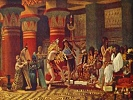

  
[Intangible Textual Heritage](../../index)  [Egypt](../index) 
[Index](index)  [Next](eml01) 

------------------------------------------------------------------------

[Buy this Book on
Kindle](https://www.amazon.com/exec/obidos/ASIN/B002KKCXC6/internetsacredte)

------------------------------------------------------------------------

  
*Egyptian Myth and Legend*, by Donald Mackenzie, \[1907\], at Intangible
Textual Heritage

------------------------------------------------------------------------

# EGYPTIAN MYTH AND LEGEND

##### With Historical Narrative, Notes on Race Problems, Comparative Beliefs, etc.

###### by

## Donald Mackenzie

#### Gresham Publishing Co., London

#### \[1907\]

Scanned, proofed and formatted at Intangible Textual Heritage, April
2002, by J. B. Hare. This text is in the public domain in the US because
it was published prior to 1923.

------------------------------------------------------------------------

[Next: Preface](eml01)

