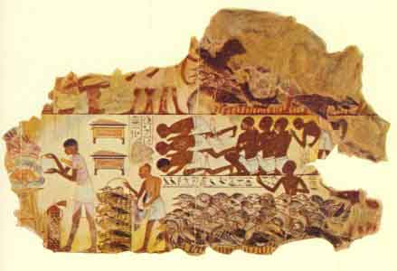

  
[Intangible Textual Heritage](../../index)  [Egypt](../index) 
[Index](index)  [Previous](eml23)  [Next](eml25) 

------------------------------------------------------------------------

[Buy this Book on
Kindle](https://www.amazon.com/exec/obidos/ASIN/B002KKCXC6/internetsacredte)

------------------------------------------------------------------------

  
*Egyptian Myth and Legend*, by Donald Mackenzie, \[1907\], at Intangible
Textual Heritage

------------------------------------------------------------------------

p. 194g

# PLATE VI

 

FARM SCENE: THE COUNTING AND INSPECTION OF THE GEESE.

(Fresco from tomb at Thebes, XVIII Dynasty, about B.C. 1580-1350

; now in British Museum)

In the upper register the seated scribe is preparing to make a list of
the geese, which are being marshalled before him. Below we see a group
of goose herds with their flock, who are making obeisance before him,
whilst one of their number places the birds in baskets. The scribe has
risen and is engaged in unrolling a new papyrus, whereon to inscribe his
list. The horizontal line of hieroglyphics above the geese contains an
exhortation of one goose herd to another to "make haste", so that he may
bring his flock before the scribe. In front of the scribe is a red
leather sack, or bag, in which he kept his clothes, &c., and round it is
rolled the mat on which he sat.

 

------------------------------------------------------------------------

[Next: Plate VII: Pastime in Ancient Egypt Three Thousand Years
Ago](eml25)

