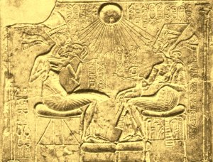
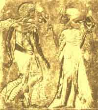
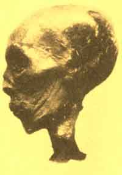
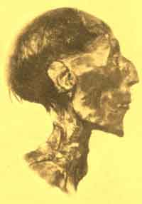
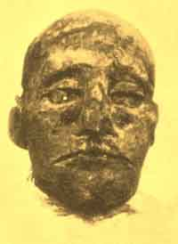
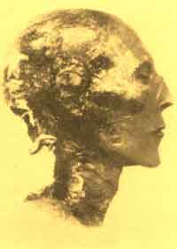

  
[Intangible Textual Heritage](../../index)  [Egypt](../index) 
[Index](index)  [Previous](eml37)  [Next](eml39) 

------------------------------------------------------------------------

[Buy this Book on
Kindle](https://www.amazon.com/exec/obidos/ASIN/B002KKCXC6/internetsacredte)

------------------------------------------------------------------------

  
*Egyptian Myth and Legend*, by Donald Mackenzie, \[1907\], at Intangible
Textual Heritage

------------------------------------------------------------------------

p. 338

# CHAPTER XXVII

### The Empire of Rameses and the Homeric Age

Sectarian Rivalries--Struggles for Political Ascendancy--New
Theology--The Dragon Slayer--Links between Sutekh, Horus, Sigurd,
Siegfried, Finn-mac-Coul, Dietrich, and Hercules--Rameses I and the
Hittites--Break-up of Mitanni Empire--Seti's Conquests--Wars of Rameses
II--Treaty with the Hittites--Pharaoh's Sublime Vanity--Sea Raids by
Europeans on Egypt--The Last Strong Pharaoh--The Great Trojan War.

THE Nineteenth Dynasty opens with Rameses I, but no record survives to
throw light on his origin, or the political movement which brought him
to the throne. He was an elderly man, and does not appear to have been
related to Horemheb. When he had reigned for about two years his son
Seti was appointed co-regent.

But although history is silent regarding the intrigues of this period,
its silence is eloquent. As the king's throne name indicates, he was
attached to the cult of Ra, and it is of significance to note that among
his other names there is no recognition of Amon.

The history of Egypt is the history of its religion. Its destinies were
controlled by its religious cults and by the sects within the cults.
Although Ra was fused with Amon, there are indications that rivalries
existed not only between Heliopolis and Thebes, but also between the
sects in Thebes, where several temples were dedicated to the national
god. The theological system which evolved from the beliefs associated
with Amon, the old as

p. 339

lunar deity, must have presented many points of difference to those
which emanated from Heliopolis, the home of scholars and speculative
thinkers. During the Eighteenth Dynasty the priesthood was divided into
two great parties: one supported the claims of Queen Hatshepsut, while
the other espoused the cause of Thothmes III. It may be that the queen
was favoured by the Ra section of the Amon-ra cult, and that her rival
was the chosen of the Amon section. The Thothmes III party retained its
political ascendancy until Thothmes IV, who worshipped Ra Harmachis, was
placed upon the throne, although not the crown prince. It is possible
that the situation created by the feuds which appear to have been waged
between the rival sects in the priesthood facilitated the religious
revolt of Akhenaton, which, it may be inferred, could have been stamped
out if the rival sects had presented a united front and made common
cause against him.

With the accession of Rameses I we appear to be confronted with the
political ascendancy of the Ra section. It is evident that the priests
effected the change in the succession to the throne, for the erection
was at once undertaken of the great colonnaded hall at Karnak, which was
completed by Rameses II. The old Amon party must have been broken up,
for the solar attributes of Amon-ra became more and more pronounced as
time went on, while lunar worship was associated mainly with Khonsu and
the imported moon goddesses of the type of Astarte and the "strange
Aphrodite". To this political and religious revolution may be attributed
the traditional prejudice against Thothmes III.

The new political party, as its "new theology" suggests, derived its
support not only from Heliopolis, but also from half-foreign Tanis in
the Delta. Influences

p. 340

from without were evidently at work. Once again, as in the latter half
of the Twelfth Dynasty and in Hyksos times, the god Set or Sutekh came
into prominence in Egypt. The son of Rameses I, Seti, was a worshipper
of Set--not the old Egyptianized devil Set, but the Set who slew the
Apep serpent, and was identified with Horus.

The Set of Rameses II, son of Seti I, [1](#fn_153) wore a conical hat like a typical
Hittite deity, arid from it was suspended a long rope or pigtail; he was
also winged like the Horus sun disk. On a small plaque of glazed
steatite this "wonderful deity" is depicted "piercing a serpent with a
large spear". The serpent is evidently the storm demon of one of the
Corycian caves in Asia Minor--the Typhon of the Greeks, which was slain
by the deity identified now with Zeus and now with Hercules. The Greek
writers who have dealt with Egyptian religion referred to "the roaring
Set" as Typhon also. The god Sutekh of Tanis combined the attributes of
the Hittite dragon slayer with those of Horus and Ra.

It is possible that to the fusion of Horus with the dragon slayer of
Asia Minor may be traced the origin of Horus as Harpocrates
(Her-pe-khred), the child god who touches his lips with an extended
finger. The Greeks called him "the god of silence"; Egyptian literature
throws no light on his original character. From what we know of Horus of
the Osirian legends there is no reason why he should have considered. it
necessary to preserve eternal silence.

In a particular type of the dragon-slaying stories of Europe, [2](#fn_154) which may have gone north from Asia
Minor

p. 341

with the worshippers of Tarku (Thor or Thunor), the hero--a humanized
deity--places his finger in his mouth for a significant reason. After
Siegfried killed the dragon he roasted its heart, and when he tasted it
he immediately understood the language of birds. Sigurd, the Norse
dragon slayer, is depicted with his thumb in his mouth after slaying
Fafher. [1](#fn_155) The Highland Finn, the
slayer of Black Arky, discovered that he had a tooth of knowledge when
he roasted a salmon, and similarly thrust his burnt finger into his
mouth. [2](#fn_156) In the Nineteenth-Dynasty
fragmentary Egyptian folktale, "Setna and the Magic Book", which has
been partially reconstructed by Professor Petrie, [1](#fn_155) Ahura relates: "He gave the book into my
hands; and when I read a page of the spells in it, I also enchanted
heaven and earth, the mountains and the sea; I also knew what the birds
of the sky, the fishes of the deep, and the beasts of the hill all
said". The prototype of Ahura in this "wonder tale" may have been Horus
as Harpocrates. Ahura, like Sigurd and Siegfried, slays a "dragon" ere
he becomes acquainted with the language of birds; it is called "a
deathless snake". "He went to the deathless snake, and fought with him,
and killed him; but he came to life again, and took a new form. He then
fought again

p. 342

with him a second time; but he came to life again, and took a third
form. He then cut him in two parts, and put sand between the parts, that
he should not appear again" (Petrie). Dietrich von Bern experienced a
similar difficulty in slaying Hilde, the giantess, so as to rescue
Hildebrand from her clutches, [1](#fn_157) and
Hercules was unable to put an end to the Hydra until Iolaus came to his
assistance with a torch to prevent the growth of heads after
decapitation. [2](#fn_158) Hercules buried the
last head in the ground, thus imitating Ahura, who "put sand between the
parts" of the "deathless snake". All these versions of a well-developed
tale appear to be offshoots of the great Cilician legend of "The War of
the Gods". Attached to an insignificant hill cave at Cromarty, in the
Scottish Highlands, is the story of the wonders of Typhon's cavern in
Sheitandere (Devil's Glen), Western Cilicia. Whether it was imported
from Greece, or taken north by the Alpine people, is a problem which
does not concern us here.

At the close of the Eighteenth Dynasty the Hittites were pressing
southward through Palestine and were even threatening the Egyptian
frontier. Indeed, large numbers of their colonists appear to have
effected settlement at Tanis, where Sutekh and Astarte had become
prominent deities. Rameses I arranged a peace treaty [3](#fn_159) with their king, Sapalul (Shubiluliuma),
although he never fought a battle, which suggests that the two men were
on friendly terms. The mother of Seti may have been a Hittite or Mitanni
princess, the daughter or grandchild

p. 343

of one of the several Egyptian princesses who were given as brides to
foreign rulers during the Eighteenth Dynasty. That the kings of the
Nineteenth Dynasty were supported by the foreign element in Egypt is
suggested by their close association with Tanis, which had become a city
of great political importance and the chief residence of the Pharaohs.
Thebes tended to become more and more an ecclesiastical capital only.

Seti I was a tall, handsome man of slim build with sharp features and a
vigorous and intelligent face. His ostentatious piety had, no doubt, a
political motive; all over Egypt his name appears on shrines, and he
restored many monuments which suffered during Akhenaton's reign. At
Abydos he built a great sanctuary to Osiris, which shows that the god
Set whom he worshipped was not the enemy of the ancient deified king,
and he had temples erected at Memphis and Heliopolis, while he carried
on the work at the great Theban colonnaded hall. He called himself "the
sun of Egypt and the moon of all other lands", an indication of the
supremacy achieved by the sun cult.

Seti was a dashing and successful soldier. He conducted campaigns
against the Libyans on the north and the Nubians in the south, but his
notable military successes were achieved in Syria.

A new Hittite king had arisen who either knew not the Pharaoh or
regarded him as too powerful a rival; at any rate, the peace was broken.
The Hittite overlord was fomenting disturbances in North Syria, and
probably also in Palestine, where the rival Semitic tribes were engaged
in constant and exhausting conflicts. He had allied himself with the
Aramæans, who were in possession of great tracts of Mesopotamia, and
with invaders from Europe of Aryan speech in the north-west of Asia
Minor.

p. 344

The Hittite Empire had been broken up. In the height of its glory its
kings had been overlords of Assyria. Tushratta's great-grandfather had
sacked Ashur, and although Tushratta owed allegiance to Egypt he was
able to send to Amenhotep III the Nineveh image of Ishtar, a sure
indication of his supremacy over that famous city. When the Mitanni
power was shattered, the Assyrians, Hittites, and Aramæans divided
between them the lands held by Tushratta and his Aryan ancestors.

Shubiluliuma was king of the Hittites when Seti scattered hordes of
desert robbers who threatened his frontier. He then pressed through
war-vexed Palestine with all the vigour and success of Thothmes III. In
the Orontes valley he met and defeated an army of Hittites, made a
demonstration before Kadesh, and returned in triumph. to Egypt. Seti
died in 1292, having reigned for over twenty years.

His son Rameses II, called "The Great" (by his own command), found it
necessary to devote the first fifteen of the sixty-seven years of his
reign to conducting strenuous military operations chiefly against the
Hittites and their allies. A new situation had arisen in Syria, which
was being colonized by the surplus population of Asia Minor. The Hittite
army followed the Hittite settlers, so that it was no longer possible
for the Egyptians to. effect a military occupation of the North Syrian
territory, held by Thothmes III and his successors, without waging
constant warfare against their powerful northern rival. Rameses II
appears, however, to have considered himself strong enough to reconquer
the lost sphere of influence for Egypt. As soon as his ambition was
realized by Mutallu, the Hittite king, a great army of allies, including
Aramæans and European raiders, was collected to await the ambitious
Pharaoh.

p. 345

Rameses had operated on the coast in his fourth year, and early in his
fifth he advanced through Palestine to the valley of the Orontes. The
Hittites and their allies were massed at Kadesh, but the Pharaoh, who
trusted the story of two natives whom he captured, believed that they
had retreated northward beyond Tunip. This seemed highly probable,
because the Egyptian scouts were unable to get into touch with the
enemy. But the overconfident Pharaoh was being led into a trap.

The Egyptian army was in four divisions, named Amon, Ra, Ptah, and
Sutekh. Rameses was in haste to invest Kadesh, and pressed on with the
Amon regiment, followed closely by the Ra regiment. The other two were,
when he reached the city, at least a day's march in the rear.

Mutallu, the Hittite king, allowed Rameses to move round Kadesh on the
western side with the Amon regiment and take up a position on the north.
Meanwhile he sent round the eastern side of the city a force of 2500
charioteers, which fell upon the Ra regiment and cut through it, driving
the greater part of it into the camp of Amon. Ere long Rameses found
himself surrounded) with only a fragment of his army remaining, for the
greater part of the Amon regiment had broken into flight with that of Ra
and were scattered towards the north.

It was a desperate situation. But although Rameses was not a great
general, he was a brave man, and fortune favoured him. Instead of
pressing the attack from the west, the Hittites began to plunder the
Egyptian camp. Their eastern wing was weak and was divided by the river
from the infantry. Rameses led a strong force of charioteers, and drove
this part of the Hittite army into the river. Meanwhile some
reinforcements came up and fell

p. 346

upon the Asiatics in the Egyptian camp, slaying them almost to a man.
Rameses was then able to collect some of his scattered forces, and he
fought desperately against the western wing of the Hittite army until
the Ptah regiment came up and drove the enemies of Egypt into the city.

Rameses had achieved a victory, but at a terrible cost. He returned to
Egypt without accomplishing the capture of Kadesh, and created for
himself a great military reputation by recording his feats of personal
valour on temple walls and monuments. A poet who sang his praises
declared that when the Pharaoh found himself surrounded, and, of course,
"alone", he called upon Ra, whereupon the sun god appeared before him
and said: "Alone thou art not, for I, thy father, am beside thee, and my
hand is more to thee than hundreds of thousands. I who love the brave am
the giver of victory." In one of his inscriptions the Pharaoh compared
himself to Baal, god of battle.

Rameses delayed but he did not prevent the ultimate advance of the
Hittites. In his subsequent campaigns he was less impetuous, but
although he occasionally penetrated far northward, he secured no
permanent hold over the territory which Thothmes III and Amenhotep "had
won for Egypt. In the end he had to content himself with the
overlordship of Palestine and part of Phœnicia. Mutalla, the Hittite
king, had to deal with a revolt among his allies, especially the
Aramæans, and was killed, and his brother Khattusil II, [1](#fn_160) who succeeded him, entered into an
offensive and defensive alliance with Rameses, probably against Assyria,
which had grown powerful and aggressive. The treaty, which was drawn up
in 1271 B.C., made reference to previous agreements, but these,
unfortunately,

p. 347

have perished; it was signed by the two monarchs, and witnessed by a
thousand Egyptian gods and a thousand Hittite gods.

Several years afterwards Khattusil visited Egypt to attend the
celebration of the marriage of his daughter to Rameses. He was
accompanied by a strong force and brought many gifts. By the great mass
of the Egyptians he was regarded as a vassal of the Pharaoh; he is
believed to be the prince referred to in the folktale which relates that
the image of the god Khonsu was sent from Egypt to cure his afflicted
daughter (see Chapter XV).

Rameses was a man of inordinate ambition and sublime vanity. He desired
to be known to posterity as the greatest Pharaoh who ever sat upon the
throne of Egypt. So he covered the land with his monuments and boastful
inscriptions, appropriated the works of his predecessors, and even
demolished temples to obtain building material. In Nubia, which had
become thoroughly Egyptianized, he erected temples to Amon, Ras and
Ptah. The greatest of these is the sublime rock temple at Abu Simbel,
which he dedicated to Amon and himself. Beside it is a small temple to
Hathor and his queen Nefertari, "whom he loves", as an inscription sets
forth. Fronting the Amon temple four gigantic colossi were erected. One
of Rameses remains complete; he sits, hands upon knees, gazing
contentedly over the desert sands; that of his wife has suffered from
falling debris, but survives in a wonderful state of preservation.

At Thebes the Pharaoh erected a large and beautiful temple of victory to
Amon-ra, which is known as the Ramesseum, and he completed the great
colonnaded hall at Karnak, the vastest structure of its kind the world
has ever seen. On the walls of the Ramesseum is the

p. 348

well-known Kadesh battle scene, sculptured in low relief. Rameses is
depicted like a giant bending his bow as he drives in his chariot,
scattering before him into the River Orontes hordes of Lilliputian
Hittites.

But although the name of' Rameses II dominates the Nile from Wady Halfa
down to the Delta, we know now that there were greater Pharaohs than he,
and, in fact, that he was a man of average ability. His mummy lies in
the Cairo museum; he has a haughty aristocratic face and a high curved
nose which suggests that he was partly of Hittite descent. He lived
until he was nearly a century old. A worshipper of voluptuous Asiatic
goddesses, he kept a crowded harem and boasted that he had a hundred
sons and a large although uncertain number of daughters.

His successor was Seti Mene-ptah. Apparently Ptah, as well as Set, had
risen into prominence, for Rameses had made his favourite son, who
predeceased him, the high priest of Memphis. The new king was well up in
years when he came to the throne in 1243 B.C. and hastened to establish
his fame by despoiling existing temples as his father had done before
him. During his reign of ten years Egypt was threatened by a new peril.
Europe was in a state of unrest, and hordes of men from "the isles" were
pouring into the Delta and allying themselves with the Libyans with
purpose to effect conquests and permanent settlement in the land of the
Pharaohs. About the same time the Phrygian occupation of the
north-western part of Asia Minor was in progress. The Hittite Empire was
doomed; it was soon to be broken up into petty states.

The Egyptian raiders appear to have been a confederacy of the old Cretan
mariners, who had turned pirates, and the kinsfolk of the peoples who
had over

 

 

AKHENATON, HIS QUEEN, AND THEIR CHILDREN

(The upper panel shows Aton, the solar disk, sustaining and protecting
royalty.  
The rays terminate in hands, some of which hold the ankh symbols.)

From bas-reliefs in the Berlin Museum

p. 349

<table data-border="0" width="798">
<colgroup>
<col style="width: 50%" />
<col style="width: 50%" />
</colgroup>
<tbody>
<tr class="odd">
<td data-valign="TOP" width="50%">
 

Thothmes II
</td>
<td data-valign="TOP" width="50%">
 

Rameses II
</td>
</tr>
<tr class="even">
<td data-valign="TOP" width="50%">
 

Rameses III
</td>
<td data-valign="TOP" width="50%">
 

Seti I
</td>
</tr>
</tbody>
</table>

MUMMY HEADS OF NOTABLE PHARAOHS

 

run the island kingdom. Included among them were the Shardana [1](#fn_161) and Danauna (? the "Danaoi" of Homer)
who were represented among the mercenaries of Pharaoh's army, the
Akhaivasha, the Shakalsha, and the Tursha. It is believed that the
Akhaivasha were the Achæans, the big, blonde, grey-eyed warriors
identified with the "Keltoi" of the ancients, who according to the
ethnologists were partly of Alpine and partly of Northern descent. It is
possible that the Shakalsha were the people who gave their name to
Sicily, and that they and the Tursha were kinsmen of the Lycians.

Pharaoh Mene-ptah was thoroughly alarmed, for the invaders penetrated as
far as Heliopolis. But the god Ptah appeared to him in a dream and
promised victory. Supported by his Shardana and Danauna mercenaries, who
had no scruples about attacking their kinsmen, he routed the army of
allies, slaying about 9000 men and taking as many prisoners.

A stele at Thebes makes reference to a campaign waged by Mene-ptah in
Palestine, where the peoples subdued included the children of Israel.

Although the son of the great Rameses II boasted that he had "united and
pacified all lands", Egypt was plunged in anarchy after his death, which
occurred in 1215 B.C. Three claimants to the throne followed in
succession in ten years, and then a Syrian usurper became the Pharaoh.
Once again the feudal lords asserted themselves, and Egypt suffered from
famine and constant disorders.

The second king of the Twentieth Dynasty, Rameses III, was the last
great Pharaoh of Egypt. In the eighth

p. 350

year of his reign a second strong sea raid occurred; it is dated between
1200 and 1190 B.C. On this occasion the invading allies were reinforced
by tribes from Asia Minor and North Syria, which included the Tikkarai,
the Muski (? Moschoi of the Greeks), and the Pulishta or Pilesti who
were known among Solomon's guards as the Peleshtem. The Pulishta are
identified as the Philistines from Crete who gave their name to
Palestine, which they occupied along the seaboard from Carmel to Ashdod
and as far inland as Beth-shan below the plain of Jezreel.

It is evident that the great raid was well organized and under the
supreme command of an experienced leader. A land force moved down the
coast of Palestine to co-operate with the fleet, and with it came the
raiders' wives and children and their goods and chattels conveyed in
wheel carts. [1](#fn_162) Rameses III was
prepared for the invasion. A land force guarded his Delta frontier and
his fleet awaited the coming of the sea raiders. The first naval battle
in history was fought within sight of the Egyptian coast, and the
Pharaoh had the stirring spectacle sculptured in low relief on the north
wall of his Amon-ra temple at Medinet Habu, on the western plain of
Thebes. The Egyptian vessels were crowded with archers who poured deadly
fusillades into the enemies' ships. An overwhelming victory was achieved
by the Pharaoh; the sea power of the raiders was completely shattered.

Rameses then marched his army northwards through Palestine to meet the
land raiders, whom he defeated somewhere in southern Phœnicia.

The great Trojan war began shortly after this great

p. 351

attack upon Egypt. According to the Greeks it was waged between 1194 and
1184 B.C. Homer's Troy, the sixth city of the archæologists, had been
built by the Phrygians. Priam was their king, and he had two sons,
Hector, the crown prince, and Paris. Menelaus had secured the throne of
Sparta by marrying Helen, the royal heiress. When, as it chanced, he
went from home--perhaps to command the sea raid upon Egypt--Paris
carried off his queen and thus became, apparently, the claimant of the
Spartan throne. On his return home Menelaus assembled an army of allies,
set sail in a fleet of sixty ships, and besieged the city of Troy. This
war of succession became the subject of Homer's great epic, the *Iliad*,
which deals with a civilization of the "Chalkosideric" period--the
interval between the Bronze and Iron Ages. [1](#fn_163)

Meanwhile Egypt had rest from its enemies. Rameses reigned for over
thirty years. He had curbed the Libyans and the Nubians as well as the
sea and land raiders, and held sway over a part of Palestine. But the
great days of Egypt had come to an end. It was weakened by internal
dissension, which was only held in check and not stamped out by an army
of foreign mercenaries, including Libyans as well as Europeans. The
national spirit flickered low among the half-foreign Egyptians of the
ruling class. When Rameses III was laid in his tomb the decline of the
power of the Pharaohs, which he had arrested for a time, proceeded
apace. The destinies of Egypt were then shaped from without rather than
from within.

------------------------------------------------------------------------

### Footnotes

[340:1](eml38.htm#fr_153) Griffiths in
*Proceedings of the Society of Biblical Archæology*, Volume XVI, pp.
88-9.

[340:2](eml38.htm#fr_154) One must distinguish
between the various kinds of mythical monsters slumped as "dragons". The
"fiery flying serpent" may resemble the "fire drake", but both p. 341 differ from the "cave dragon" which does not
spout fire and the "beast" of Celtic story associated with rivers,
lakes, and the sea. The latter is found in Japan and China, as well as
in Scotland and Ireland. In "Beowulf", Grendel and his mother belong to
the water "beast" order; the dragon which causes the hero's death is a
"fire drake". Egypt has also its flood and fire monsters. Thor slew the
Midgard serpent at the battle of the "Dusk of the Gods".

[341:1](eml38.htm#fr_157) *Teutonic Myth and
Legend*.

[341:2](eml38.htm#fr_156) *Finn and his Warrior
Band*. The salmon is associated with the water "dragon"; the "essence",
or soul, of the demon was in the fish, as the "essence" of Osiris was in
Amon. It would appear that the various forms of the monster had to be
slain to complete its destruction. This conception is allied to the
belief in transmigration of souls.

[342:1](eml38.htm#fr_158) *Teutonic Myth and
Legend*. In Swedish and Gaelic stories similar incidents occur.

[342:2](eml38.htm#fr_159) *Classic Myth and
Legend*. The colourless character of the Egyptian legend suggests that
it was imported, like Sutekh; its significance evidently faded in the
new geographical setting.

[342:3](eml38.htm#fr_160) It is referred to in
the subsequent treaty between Rameses II and the Hittite king.

[346:1](eml38.htm#fr_161) Known to the
Egyptians as Khetasar.

[349:1](eml38.htm#fr_162) The old Cretans, the
"Keftiu", are not referred to by the Egyptians after the reign of
Amenhotep III. These newcomers were evidently the destroyers of the
great palace at Knossos.

[350:1](eml38.htm#fr_163) When the Philistines
were advised by their priests to return the ark to the Israelites it was
commanded: "Now, therefore make a new cart and take two milch kine and
tie the kine to the cart".--(*1 Samuel* vi, 7).

[351:1](eml38.htm#fr_164) The Cuchullin saga of
Ireland belongs to the same archæological period; bronze and iron
weapons were used. Cuchullin is the Celtic Achilles; to both heroes were
attached the attributes of some old tribal god. The spot on the heel of
Achilles is shared by the more primitive Diarmid of the Ossianic saga.

------------------------------------------------------------------------

[Next: Chapter XXVIII: Egypt and the Hebrew Monarchy](eml39)

