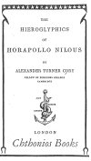
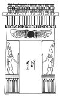

  
[Intangible Textual Heritage](../../index)  [Egypt](../index) 
[Index](index)  [Next](hh001) 

------------------------------------------------------------------------

[Buy this Book at
Amazon.com](https://www.amazon.com/exec/obidos/ASIN/1428631488/internetsacredte)

------------------------------------------------------------------------

*Hieroglyphics of Horapollo*, tr. Alexander Turner Cory, \[1840\], at
Intangible Textual Heritage

------------------------------------------------------------------------

###### THE

## HIEROGLYPHICS

###### OF

# HORAPOLLO NILOUS

###### BY

### ALEXANDER TURNER CORY

###### FELLOW OF PEMBROKE COLLEGE

###### CAMBRIDGE

#### Chthonios Books, London

#### \[1840\]

Scanned at Intangible Textual Heritage, December 2006. This text is in
the public domain in the United States because it was published prior to
January 1st, 1923. These files may be used for any purpose provided this
notice of attribution is left intact.

[  
Click to enlarge](img/title.jpg)  
Title Page  

[  
Click to enlarge](img/verso.jpg)  
Verso  

------------------------------------------------------------------------

[Next: Preface](hh001)
