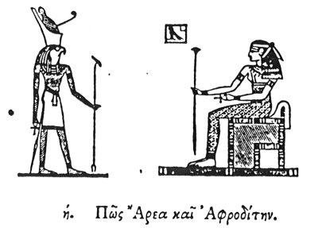

  
[Intangible Textual Heritage](../../index)  [Egypt](../index) 
[Index](index)  [Previous](hh009)  [Next](hh011) 

------------------------------------------------------------------------

[Buy this Book at
Amazon.com](https://www.amazon.com/exec/obidos/ASIN/1428631488/internetsacredte)

------------------------------------------------------------------------

*Hieroglyphics of Horapollo*, tr. Alexander Turner Cory, \[1840\], at
Intangible Textual Heritage

------------------------------------------------------------------------

### VIII. HOW ARES AND APHRODITE (HOR AND HATHOR.) [1](#fn_24)

  [2](#fn_23)

'To denote *Ares* and *Aphrodite* (*Hor* and *Athor*), they delineate
TWO HAWKS; [1](#fn_24) of

p. 17

which they assimilate the male to Ares (Hor), and the female to
Aphrodite (Hathor), for this reason, quod ex cæteris animantibus fœmina
mari non ad omnem congressum obtemperat, ut in accipitrum genere, in quo
etsi tricies in die fœmina a mare comprimatur, ab eo digressa, si
inclamata fuerit paret iterum. Wherefore the Egyptians call every female
that is obedient to her husband Aphrodite (Hathor), but one that is not
obedient they do not so denominate. For this reason they have
consecrated the hawk to the sun: for, like the sun, it completes the
number thirty in its conjunctions with the female.

When they would denote *Ares* and *Aphrodite* (*Hor* and *Athor*)
otherwise, they

p. 18

depict TWO CROWS \[ravens?\] as a man and woman; because this bird lays
two eggs, from which a male and female ought to be produced, and,
(\[except?\] when it produces two males or two females, which, however,
rarely happens,) the males mate with the females, and hold no
intercourse with any other crow, neither does the female with any other
crow, till death; but those that are widowed pass their lives in
solitude. And hence, when men meet with a single crow, they look upon it
as an omen, as having met with a widowed creature; and [1](#fn_25) on account of the remarkable concord of
these birds, the Greeks to this day in their marriages exclaim, EKKOKI
KORI KORONE, though unacquainted with its import.

------------------------------------------------------------------------

### Footnotes

[16:2](hh010.htm#fr_25)

I. *Hor or Horus*.

II\. *Athor, Hathor, or Thyhor, the Egyptian Venus*.

[16:1](hh010.htm#fr_26) To denote *Hor*, they
delineate a HAWK; and to denote *Hathor*, a HAWK WITHIN AN ENCLOSURE, as
in the figure, which is read as an abode of Horus. Plutarch states that
ATHURI signifies *Horus's mundane house*.

[18:1](hh010.htm#fr_27) Treb. omits the
concluding sentence from ζώῳ

------------------------------------------------------------------------

[Next: IX. How Marriage](hh011)
