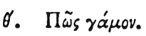

  
[Intangible Textual Heritage](../../index)  [Egypt](../index) 
[Index](index)  [Previous](hh010)  [Next](hh012) 

------------------------------------------------------------------------

[Buy this Book at
Amazon.com](https://www.amazon.com/exec/obidos/ASIN/1428631488/internetsacredte)

------------------------------------------------------------------------

*Hieroglyphics of Horapollo*, tr. Alexander Turner Cory, \[1840\], at
Intangible Textual Heritage

------------------------------------------------------------------------

p. 19

### IX. HOW MARRIAGE.

 

To denote *marriage*, they again depict TWO CROWS, on account of what
has been mentioned.

------------------------------------------------------------------------

[Next: X. How an Only Begotten](hh012)
