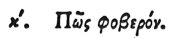

  
[Intangible Textual Heritage](../../index)  [Egypt](../index) 
[Index](index)  [Previous](hh021)  [Next](hh023) 

------------------------------------------------------------------------

[Buy this Book at
Amazon.com](https://www.amazon.com/exec/obidos/ASIN/1428631488/internetsacredte)

------------------------------------------------------------------------

*Hieroglyphics of Horapollo*, tr. Alexander Turner Cory, \[1840\], at
Intangible Textual Heritage

------------------------------------------------------------------------

p. 41

### XX. HOW THE TERRIBLE.

 

To signify the *terrible* they make use of the SAME SYMBOL, [1](#fn_44) because this animal, being the most
powerful, terrifies all who behold it.

------------------------------------------------------------------------

### Footnotes

[41:1](hh022.htm#fr_46) See Chap. XVIII.

------------------------------------------------------------------------

[Next: XXI. How the Rising of the Nile](hh023)
