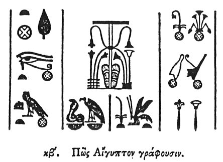

  
[Intangible Textual Heritage](../../index)  [Egypt](../index) 
[Index](index)  [Previous](hh023)  [Next](hh025) 

------------------------------------------------------------------------

[Buy this Book at
Amazon.com](https://www.amazon.com/exec/obidos/ASIN/1428631488/internetsacredte)

------------------------------------------------------------------------

*Hieroglyphics of Horapollo*, tr. Alexander Turner Cory, \[1840\], at
Intangible Textual Heritage

------------------------------------------------------------------------

p. 45

### XXII. HOW THEY DESIGNATE EGYPT.

  [1](#fn_47)

To designate *Egypt*, [2](#fn_48) they depict a
BURNING CENSER AND A HEART. ABOVE IT, implying, that as the heart of a
jealous person is constantly inflamed, so Egypt from its heat
perpetually vivifies the things which are in or near it.

------------------------------------------------------------------------

### Footnotes

[45:1](hh024.htm#fr_49)

*Of the above nine hieroglyphical groups,* I, II, III, *upon the left,
signify Egypt. The fourth, in the centre, signifies Upper and Lower
Egypt; and is apparently that to which Horapollo alludes, but is
mistaken in his description of it.* V*, and* VI*, immediately beneath
it, denote King, and King of the Upper and Lower country. And* XII*,*
VIII*,* IX*, upon the right, signify the Upper and Lower country*.

[45:2](hh024.htm#fr_50) Qy. Αἴγυπτος, the Nile?
or Egypt after the inundation?

------------------------------------------------------------------------

[Next: XXIII. How a Man That Has Not Travelled Abroad](hh025)
