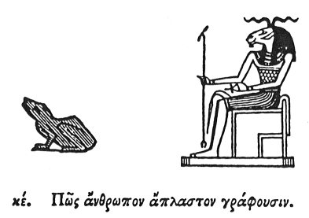

  
[Intangible Textual Heritage](../../index)  [Egypt](../index) 
[Index](index)  [Previous](hh026)  [Next](hh028) 

------------------------------------------------------------------------

[Buy this Book at
Amazon.com](https://www.amazon.com/exec/obidos/ASIN/1428631488/internetsacredte)

------------------------------------------------------------------------

*Hieroglyphics of Horapollo*, tr. Alexander Turner Cory, \[1840\], at
Intangible Textual Heritage

------------------------------------------------------------------------

### XXV. HOW THEY DENOTE AN IMPERFECT MAN.

  [1](#fn_51)

To denote an imperfect man, they delineate a FROG, because it is
generated from the slime of the river, whence

p. 48

it occasionally happens that it is seen with one part of a frog, and the
remainder formed of slime, so that should the river fall, the animal
would be left imperfect.

------------------------------------------------------------------------

### Footnotes

[47:1](hh027.htm#fr_53)

I. *A common hieroglyphic, but not ascertained. In the British Museum is
an inscription, in which Kneph is called* "*the king of Frog*s."—Birch.

II\. *Kneph*.

------------------------------------------------------------------------

[Next: XXVI. How an Opening](hh028)
