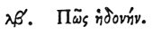

  
[Intangible Textual Heritage](../../index)  [Egypt](../index) 
[Index](index)  [Previous](hh033)  [Next](hh035) 

------------------------------------------------------------------------

[Buy this Book at
Amazon.com](https://www.amazon.com/exec/obidos/ASIN/1428631488/internetsacredte)

------------------------------------------------------------------------

*Hieroglyphics of Horapollo*, tr. Alexander Turner Cory, \[1840\], at
Intangible Textual Heritage

------------------------------------------------------------------------

### XXXII. HOW DELIGHT.

 

When they would represent *delight* they depict the NUMBER 16; [1](#fn_55) for from this age men

p. 53

begin to hold commerce with women, and to procreate children.

------------------------------------------------------------------------

### Footnotes

[52:1](hh034.htm#fr_57) Leemans very happily
suggests, from the following passage in Pliny. *Nat. Hist*. V. 9., that
the symbol had some reference to the rising of the Nile: "Justum
incrementum est cubitorum sedecim . . . . . . . in duodecim cubitis
famem sentit; in tredecim etiamnum esurit; quatuordecim cubits
hilaritatem adferunt; quindecim securitatem; *sedecim delicias*."

------------------------------------------------------------------------

[Next: XXXIII. How Sexual Intercourse](hh035)
