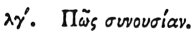

  
[Intangible Textual Heritage](../../index)  [Egypt](../index) 
[Index](index)  [Previous](hh034)  [Next](hh036) 

------------------------------------------------------------------------

[Buy this Book at
Amazon.com](https://www.amazon.com/exec/obidos/ASIN/1428631488/internetsacredte)

------------------------------------------------------------------------

*Hieroglyphics of Horapollo*, tr. Alexander Turner Cory, \[1840\], at
Intangible Textual Heritage

------------------------------------------------------------------------

### XXXIII. HOW SEXUAL INTERCOURSE.

 

To denote *sexual intercourse* they depict TWO NUMBERS 16. Cum enim
sedecim voluptatem esse diximus; congressus autem, duplici constet,
maris ac fœminæ, voluptate, propterea alia sedecim adscribunt.

------------------------------------------------------------------------

[Next: XXXIV. How a Soul Continuing a Long Time Here](hh036)
