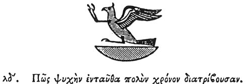

  
[Intangible Textual Heritage](../../index)  [Egypt](../index) 
[Index](index)  [Previous](hh035)  [Next](hh037) 

------------------------------------------------------------------------

[Buy this Book at
Amazon.com](https://www.amazon.com/exec/obidos/ASIN/1428631488/internetsacredte)

------------------------------------------------------------------------

*Hieroglyphics of Horapollo*, tr. Alexander Turner Cory, \[1840\], at
Intangible Textual Heritage

------------------------------------------------------------------------

p. 54

### XXXIV. HOW A SOUL CONTINUING A LONG TIME HERE.

  [1](#fn_56)

When they would denote a *soul continuing a long time here*, [2](#fn_57) or an *inundation*, they depict the PHŒNIX
the bird: [3](#fn_58) and they denote the *soul*
by it, because this is the longest lived of all creatures in the world;
and an *inundation*, because the Phœnix is a symbol of the sun, than
which nothing is greater in the universe. For the sun passes over all
and

p. 55

scrutinises all, hence he is called . . . . . Polys [1](#fn_59) (much).

------------------------------------------------------------------------

### Footnotes

[54:1](hh036.htm#fr_58)

*The Phœnix*.

[54:2](hh036.htm#fr_59) Qy. 'When they would
denote *the soul*, or *an expiring cycle of time*, or *an inundation*?'
Of the two first the Phœnix was certainly a symbol, and possibly of the
last, on account of its periodical return.

[54:3](hh036.htm#fr_60) The Phœnix the Bird, to
distinguish it from the Phœnix the Palm branch.—See Ch. 7.

[55:1](hh036.htm#fr_61) Phanes? Apollo.

------------------------------------------------------------------------

[Next: XXXV. How a Man Returning Home After a Long Time From a Foreign
Land](hh037)
