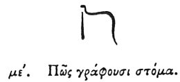

  
[Intangible Textual Heritage](../../index)  [Egypt](../index) 
[Index](index)  [Previous](hh046)  [Next](hh048) 

------------------------------------------------------------------------

[Buy this Book at
Amazon.com](https://www.amazon.com/exec/obidos/ASIN/1428631488/internetsacredte)

------------------------------------------------------------------------

*Hieroglyphics of Horapollo*, tr. Alexander Turner Cory, \[1840\], at
Intangible Textual Heritage

------------------------------------------------------------------------

p. 66

### XLV. HOW THEY REPRESENT THE MOUTH.

 

To represent the *mouth* they depict a SERPENT, because the serpent is
powerful in no other of its members except the mouth alone.

------------------------------------------------------------------------

[Next: XLVI. How Manliness Combined with Temperance](hh048)
