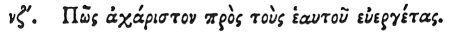

  
[Intangible Textual Heritage](../../index)  [Egypt](../index) 
[Index](index)  [Previous](hh058)  [Next](hh060) 

------------------------------------------------------------------------

[Buy this Book at
Amazon.com](https://www.amazon.com/exec/obidos/ASIN/1428631488/internetsacredte)

------------------------------------------------------------------------

*Hieroglyphics of Horapollo*, tr. Alexander Turner Cory, \[1840\], at
Intangible Textual Heritage

------------------------------------------------------------------------

p. 78

### LVII. HOW ONE WHO 1S UNGRATEFUL TO HIS BENEFACTORS.

 

To signify a *man that is ungrateful and quarrelsome with his
benefactors*, they delineate a Dove, for when the male becomes the
stronger, the drives his father away from his mother, and mates himself
with her. This creature however seems to be pure, because when any
pestilential epidemic rages, and every thing, animate and inanimate,
sickens with disease, those persons alone who feed upon this bird do not
share in so great a calamity. Wherefore during such a time nothing is
served up to the king as food except the dove alone. And the same food
is served up to those who are under a course of purification,

p. 79

that they may minister to the gods. It is likewise reported that this
creature has no gall.

------------------------------------------------------------------------

[Next: LVIII. How an Impossibility](hh060)
