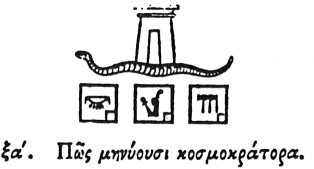

  
[Intangible Textual Heritage](../../index)  [Egypt](../index) 
[Index](index)  [Previous](hh062)  [Next](hh064) 

------------------------------------------------------------------------

[Buy this Book at
Amazon.com](https://www.amazon.com/exec/obidos/ASIN/1428631488/internetsacredte)

------------------------------------------------------------------------

*Hieroglyphics of Horapollo*, tr. Alexander Turner Cory, \[1840\], at
Intangible Textual Heritage

------------------------------------------------------------------------

### LXI. HOW THEY DESIGNATE A RULER OF THE WORLD.

  [1](#fn_87)

Again when they would

p. 82

signify and designate a *king who rules the world*, they delineate the
same SERPENT, and in the middle thereof they represent a LARGE HOUSE,
and with reason for the royal abode from him - - - - - - in the world.

------------------------------------------------------------------------

### Footnotes

[81:1](hh063.htm#fr_89)

I. *After the king's name has been once or twice given in an
inscription, a serpent seems to be sometimes substituted*.

II\. *From Belzoni's tomb*.

III\. *Golden house or palace*.—Sh. 380.

IV\. *King's house or palace*.—Sh. 379.

V. *God's house or temple*.—Sh. 371.

------------------------------------------------------------------------

[Next: LXII. How a People Obedient to Their King](hh064)
