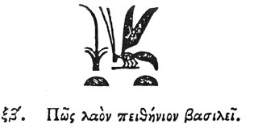

  
[Intangible Textual Heritage](../../index)  [Egypt](../index) 
[Index](index)  [Previous](hh063)  [Next](hh065) 

------------------------------------------------------------------------

[Buy this Book at
Amazon.com](https://www.amazon.com/exec/obidos/ASIN/1428631488/internetsacredte)

------------------------------------------------------------------------

*Hieroglyphics of Horapollo*, tr. Alexander Turner Cory, \[1840\], at
Intangible Textual Heritage

------------------------------------------------------------------------

### LXII. HOW A PEOPLE OBEDIENT TO THEIR KING.

  [1](#fn_88)

To denote a *people obedient to their king*, they depict a BEE, for this
is the only one of all creatures which has a king whom the rest of the
tribe of bees obey, as men serve their king. And they intimate from the
honey's - - - - - - from the force of the creature's sting - - - - that

p. 83

\[paragraph continues\] - - - - should be
both lenient and firm in - - - - and administration.

------------------------------------------------------------------------

### Footnotes

[82:1](hh064.htm#fr_90)

*Champollion interprets this as* '*King of an obedient people;*'
*Sharpe, as* '*King of Upper and Lower Egypt*.'—Sh. 417. 419.

------------------------------------------------------------------------

[Next: LXIII. How a King Who Governs a Part of the World](hh065)
