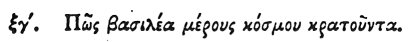

  
[Intangible Textual Heritage](../../index)  [Egypt](../index) 
[Index](index)  [Previous](hh064)  [Next](hh066) 

------------------------------------------------------------------------

[Buy this Book at
Amazon.com](https://www.amazon.com/exec/obidos/ASIN/1428631488/internetsacredte)

------------------------------------------------------------------------

*Hieroglyphics of Horapollo*, tr. Alexander Turner Cory, \[1840\], at
Intangible Textual Heritage

------------------------------------------------------------------------

### LXIII. HOW A KING WHO GOVERNS A PART OF THE WORLD.

 

When they would symbolize a *king who governs not all but a part of the
world*, they depict HALF A SERPENT. For by this creature they denote a
king, and by half of it, that he is not king over all the world.

------------------------------------------------------------------------

[Next: LXIV. How One Who Governs All Things](hh066)
