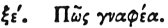

  
[Intangible Textual Heritage](../../index)  [Egypt](../index) 
[Index](index)  [Previous](hh066)  [Next](hh068) 

------------------------------------------------------------------------

[Buy this Book at
Amazon.com](https://www.amazon.com/exec/obidos/ASIN/1428631488/internetsacredte)

------------------------------------------------------------------------

*Hieroglyphics of Horapollo*, tr. Alexander Turner Cory, \[1840\], at
Intangible Textual Heritage

------------------------------------------------------------------------

### LXV. HOW A FULLER. [1](#fn_90)

  [1](#fn_90)

To denote a *fuller*, they depict the TWO FEET OF A MAN IN WATER, and
they depict this from the resemblance of the work.

------------------------------------------------------------------------

### Footnotes

[84:1](hh067.htm#fr_94) γραφέα, Par B. C.—Qy.
Kneph, the spirit pervading the universe, and moving on the water. See
Chaps. 23 and 58.

------------------------------------------------------------------------

[Next: LXVI. How a Month](hh068)
