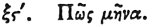

  
[Intangible Textual Heritage](../../index)  [Egypt](../index) 
[Index](index)  [Previous](hh067)  [Next](hh069) 

------------------------------------------------------------------------

[Buy this Book at
Amazon.com](https://www.amazon.com/exec/obidos/ASIN/1428631488/internetsacredte)

------------------------------------------------------------------------

*Hieroglyphics of Horapollo*, tr. Alexander Turner Cory, \[1840\], at
Intangible Textual Heritage

------------------------------------------------------------------------

### LXVI. HOW A MONTH. [2](#fn_91)

  [2](#fn_91)

To represent a *month*, they depict as before explained the figure of
the MOON when it has attained the age of eight and twenty days of equal
lengths, each day containing twenty-four

p. 85

hours, for during these it is apparent, and in the remaining two it is
in a state of evanescence.

------------------------------------------------------------------------

### Footnotes

[84:2](hh068.htm#fr_96) Treb. om. this chap.—See
illustrations of Chap. 4.

------------------------------------------------------------------------

[Next: LXVII. How a Rapacious, or Prolific, or Furious Man](hh069)
