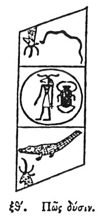

  
[Intangible Textual Heritage](../../index)  [Egypt](../index) 
[Index](index)  [Previous](hh070)  [Next](hh072) 

------------------------------------------------------------------------

[Buy this Book at
Amazon.com](https://www.amazon.com/exec/obidos/ASIN/1428631488/internetsacredte)

------------------------------------------------------------------------

*Hieroglyphics of Horapollo*, tr. Alexander Turner Cory, \[1840\], at
Intangible Textual Heritage

------------------------------------------------------------------------

### LXIX. HOW SUNSET.

  [1](#fn_92)

To denote *sunset*, they represent A CROCODILE TENDING DOWNWARDS, for
this animal is self productive \[?\] and inclining downwards.

------------------------------------------------------------------------

### Footnotes

[86:1](hh071.htm#fr_97)

*This illustration is front the descent in Belzoni's tomb. The central
group is connected with the sun, and the stags’ heads appear to be
emblems of eternity, or renovation. See Pl. II. and also Book II. Chap*.
21.

------------------------------------------------------------------------

[Next: LXX. How They Shadow Forth Darkness](hh072)
