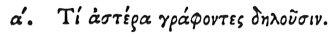

  
[Intangible Textual Heritage](../../index)  [Egypt](../index) 
[Index](index)  [Previous](hh073)  [Next](hh075) 

------------------------------------------------------------------------

[Buy this Book at
Amazon.com](https://www.amazon.com/exec/obidos/ASIN/1428631488/internetsacredte)

------------------------------------------------------------------------

*Hieroglyphics of Horapollo*, tr. Alexander Turner Cory, \[1840\], at
Intangible Textual Heritage

------------------------------------------------------------------------

### I. WHAT THEY SIGNIFY BY DEPICTING A STAR.  [1](#fn_94)

 

When a STAR is depicted by the Egyptians, it sometimes symbolizes *God*,
sometimes evening, sometimes *night*, sometimes *time*, and sometimes
the *soul* of a male man.

------------------------------------------------------------------------

### Footnotes

[93:1](hh074.htm#fr_99)

I. *The Star signer nod. See Book I. c.* 13.

------------------------------------------------------------------------

[Next: II. What by an Eaglet](hh075)
