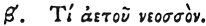

  
[Intangible Textual Heritage](../../index)  [Egypt](../index) 
[Index](index)  [Previous](hh074)  [Next](hh076) 

------------------------------------------------------------------------

[Buy this Book at
Amazon.com](https://www.amazon.com/exec/obidos/ASIN/1428631488/internetsacredte)

------------------------------------------------------------------------

*Hieroglyphics of Horapollo*, tr. Alexander Turner Cory, \[1840\], at
Intangible Textual Heritage

------------------------------------------------------------------------

p. 94

### II. WHAT BY AN EAGLET.

  [1](#fn_95)

An EAGLET symbolizes something *prolific of males*, or *of a circular
form*, or the seed of man.

------------------------------------------------------------------------

### Footnotes

[94:1](hh075.htm#fr_100) Treb. omits this
chapter.

------------------------------------------------------------------------

[Next: III. What by Two Feet Conjoined and Advancing](hh076)
