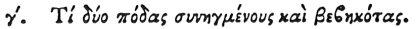

  
[Intangible Textual Heritage](../../index)  [Egypt](../index) 
[Index](index)  [Previous](hh075)  [Next](hh077) 

------------------------------------------------------------------------

[Buy this Book at
Amazon.com](https://www.amazon.com/exec/obidos/ASIN/1428631488/internetsacredte)

------------------------------------------------------------------------

*Hieroglyphics of Horapollo*, tr. Alexander Turner Cory, \[1840\], at
Intangible Textual Heritage

------------------------------------------------------------------------

### III. WHAT BY TWO FEET CONJOINED AND ADVANCING.

 

Two FEET CONJOINED AND ADVANCING, symbolize the *course of the sun in
the winter solstice*.

------------------------------------------------------------------------

[Next: IV. What by the Heart of a Man Suspended by the Windpipe](hh077)
