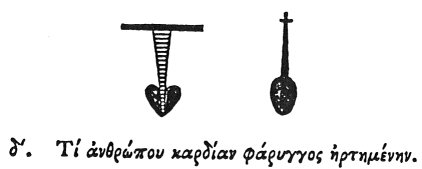

  
[Intangible Textual Heritage](../../index)  [Egypt](../index) 
[Index](index)  [Previous](hh076)  [Next](hh078) 

------------------------------------------------------------------------

[Buy this Book at
Amazon.com](https://www.amazon.com/exec/obidos/ASIN/1428631488/internetsacredte)

------------------------------------------------------------------------

*Hieroglyphics of Horapollo*, tr. Alexander Turner Cory, \[1840\], at
Intangible Textual Heritage

------------------------------------------------------------------------

p. 95

### IV. WHAT BY THE HEART OF A MAN SUSPENDED BY THE WINDPIPE.

  [1](#fn_96)

The HEART OF A MAN SUSPENDED BY THE WINDPIPE signifies the *mouth of a
good man*.

------------------------------------------------------------------------

### Footnotes

[95:1](hh077.htm#fr_101)

IV\. *The first signifies Good, and seems to be the hieroglyphic
referred to, but mistaken for the other. It is a musical instrument*.

V. *Victorious. Sh*.

------------------------------------------------------------------------

[Next: V. How They Denote the Front of Battle](hh078)
