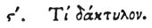

  
[Intangible Textual Heritage](../../index)  [Egypt](../index) 
[Index](index)  [Previous](hh078)  [Next](hh080) 

------------------------------------------------------------------------

[Buy this Book at
Amazon.com](https://www.amazon.com/exec/obidos/ASIN/1428631488/internetsacredte)

------------------------------------------------------------------------

*Hieroglyphics of Horapollo*, tr. Alexander Turner Cory, \[1840\], at
Intangible Textual Heritage

------------------------------------------------------------------------

p. 96

### VI. WHAT BY A FINGER.

 

A FINGER denotes *the stomach of a man*.

------------------------------------------------------------------------

[Next: VII. Quid Penis Manu Compressa](hh080)
