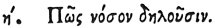

  
[Intangible Textual Heritage](../../index)  [Egypt](../index) 
[Index](index)  [Previous](hh080)  [Next](hh082) 

------------------------------------------------------------------------

[Buy this Book at
Amazon.com](https://www.amazon.com/exec/obidos/ASIN/1428631488/internetsacredte)

------------------------------------------------------------------------

*Hieroglyphics of Horapollo*, tr. Alexander Turner Cory, \[1840\], at
Intangible Textual Heritage

------------------------------------------------------------------------

### VIII. HOW THEY DENOTE DISEASE.

 

The FLOWERS OF THE ANEMONY denote *disease of a man*.

------------------------------------------------------------------------

[Next: IX. How the Loins of a Man](hh082)
