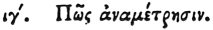

  
[Intangible Textual Heritage](../../index)  [Egypt](../index) 
[Index](index)  [Previous](hh085)  [Next](hh087) 

------------------------------------------------------------------------

[Buy this Book at
Amazon.com](https://www.amazon.com/exec/obidos/ASIN/1428631488/internetsacredte)

------------------------------------------------------------------------

*Hieroglyphics of Horapollo*, tr. Alexander Turner Cory, \[1840\], at
Intangible Textual Heritage

------------------------------------------------------------------------

### XIII. HOW ADMEASUREMENT.

 

The FINGER OF A MAN denotes admeasurement.

------------------------------------------------------------------------

[Next: XIV. How a Woman Pregnant](hh087)
