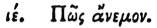

  
[Intangible Textual Heritage](../../index)  [Egypt](../index) 
[Index](index)  [Previous](hh086)  [Next](hh088) 

------------------------------------------------------------------------

[Buy this Book at
Amazon.com](https://www.amazon.com/exec/obidos/ASIN/1428631488/internetsacredte)

------------------------------------------------------------------------

*Hieroglyphics of Horapollo*, tr. Alexander Turner Cory, \[1840\], at
Intangible Textual Heritage

------------------------------------------------------------------------

p. 99

### XIV. HOW A WOMAN PREGNANT.

 

When they would denote a *woman pregnant*, they portray the ORB OF THE
SUN WITH A STAR AND THE SUN'S DISK BISECTED.

------------------------------------------------------------------------

[Next: XV. How Wind](hh088)
