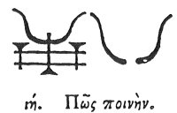

  
[Intangible Textual Heritage](../../index)  [Egypt](../index) 
[Index](index)  [Previous](hh090)  [Next](hh092) 

------------------------------------------------------------------------

[Buy this Book at
Amazon.com](https://www.amazon.com/exec/obidos/ASIN/1428631488/internetsacredte)

------------------------------------------------------------------------

*Hieroglyphics of Horapollo*, tr. Alexander Turner Cory, \[1840\], at
Intangible Textual Heritage

------------------------------------------------------------------------

### XVIII. HOW PUNISHMENT.

  [1](#fn_100)

A cow's HORN when depicted signifies punishment.

------------------------------------------------------------------------

### Footnotes

[100:1](hh091.htm#fr_105)

XVIII\. *The Horns are used as the syllable* "*An*," *as in Anepo*.

------------------------------------------------------------------------

[Next: XIX. How Impiety](hh092)
