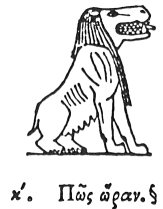

  
[Intangible Textual Heritage](../../index)  [Egypt](../index) 
[Index](index)  [Previous](hh092)  [Next](hh094) 

------------------------------------------------------------------------

[Buy this Book at
Amazon.com](https://www.amazon.com/exec/obidos/ASIN/1428631488/internetsacredte)

------------------------------------------------------------------------

*Hieroglyphics of Horapollo*, tr. Alexander Turner Cory, \[1840\], at
Intangible Textual Heritage

------------------------------------------------------------------------

### XX. HOW AN HOUR \[EXECRATION?\].

  [2](#fn_102) [3](#fn_103)

A RIVER HORSE when delineated, denotes *an hour*.

------------------------------------------------------------------------

### Footnotes

[101:2](hh093.htm#fr_107)

XX\. *Commonly found near Osiris in the judgment scenes*. Qy.

[101:3](hh093.htm#fr_108) Causs. sug. ἄραν, A
curse.—De Pauw. φθόραν, Destruction.

------------------------------------------------------------------------

[Next: XXI. How Anything of Long Duration](hh094)
