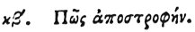

  
[Intangible Textual Heritage](../../index)  [Egypt](../index) 
[Index](index)  [Previous](hh094)  [Next](hh096) 

------------------------------------------------------------------------

[Buy this Book at
Amazon.com](https://www.amazon.com/exec/obidos/ASIN/1428631488/internetsacredte)

------------------------------------------------------------------------

*Hieroglyphics of Horapollo*, tr. Alexander Turner Cory, \[1840\], at
Intangible Textual Heritage

------------------------------------------------------------------------

### XXII. HOW AVERSION.

 

A WOLF OR A DOG AVERTED denotes *aversion*.

------------------------------------------------------------------------

[Next: XXIII. How a Future Act](hh096)
