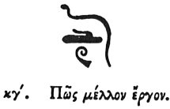

  
[Intangible Textual Heritage](../../index)  [Egypt](../index) 
[Index](index)  [Previous](hh095)  [Next](hh097) 

------------------------------------------------------------------------

[Buy this Book at
Amazon.com](https://www.amazon.com/exec/obidos/ASIN/1428631488/internetsacredte)

------------------------------------------------------------------------

*Hieroglyphics of Horapollo*, tr. Alexander Turner Cory, \[1840\], at
Intangible Textual Heritage

------------------------------------------------------------------------

p. 103

### XXIII. HOW A FUTURE ACT.

  [1](#fn_106)

An EAR when delineated symbolizes *a future act*.

------------------------------------------------------------------------

### Footnotes

[103:1](hh096.htm#fr_111)

XXIII\. *Immortal or Eternal*. Sh. 318. *Qy. Extension in time. The coil
may have been mistaken by Horapollo for an ear*.

------------------------------------------------------------------------

[Next: XXIV. How a Murderer, or the Blood of a Crocodile](hh097)
