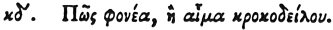

  
[Intangible Textual Heritage](../../index)  [Egypt](../index) 
[Index](index)  [Previous](hh096)  [Next](hh098) 

------------------------------------------------------------------------

[Buy this Book at
Amazon.com](https://www.amazon.com/exec/obidos/ASIN/1428631488/internetsacredte)

------------------------------------------------------------------------

*Hieroglyphics of Horapollo*, tr. Alexander Turner Cory, \[1840\], at
Intangible Textual Heritage

------------------------------------------------------------------------

### XXIV. HOW A MURDERER, OR THE BLOOD OF A CROCODILE.

 

A WASP FLYING IN THE AIR signifies either the noxious *blood of a
crocodile*, or a *murderer*.

------------------------------------------------------------------------

[Next: XXV. How Death](hh098)
