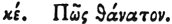

  
[Intangible Textual Heritage](../../index)  [Egypt](../index) 
[Index](index)  [Previous](hh097)  [Next](hh099) 

------------------------------------------------------------------------

[Buy this Book at
Amazon.com](https://www.amazon.com/exec/obidos/ASIN/1428631488/internetsacredte)

------------------------------------------------------------------------

*Hieroglyphics of Horapollo*, tr. Alexander Turner Cory, \[1840\], at
Intangible Textual Heritage

------------------------------------------------------------------------

### XXV. HOW DEATH.

 

A NIGHT RAVEN signifies *death;* [2](#fn_107)
for it suddenly pounces

p. 104

upon the young of the crows by night, as death suddenly overtakes men.

------------------------------------------------------------------------

### Footnotes

[103:2](hh098.htm#fr_112) Qy. Erebus? The
Hebrew word ‏ערב‎, EREB, signifies either p.
104 Erebus darkness, or the Nightraven, and it appears by
Damascius, that the Sidonians substituted this bird as an emblem of
Erebus.—An. Frag. p. 319.

------------------------------------------------------------------------

[Next: XVI. How Love](hh099)
