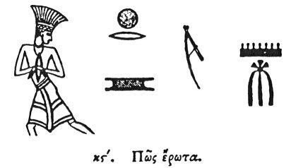

  
[Intangible Textual Heritage](../../index)  [Egypt](../index) 
[Index](index)  [Previous](hh098)  [Next](hh100) 

------------------------------------------------------------------------

[Buy this Book at
Amazon.com](https://www.amazon.com/exec/obidos/ASIN/1428631488/internetsacredte)

------------------------------------------------------------------------

*Hieroglyphics of Horapollo*, tr. Alexander Turner Cory, \[1840\], at
Intangible Textual Heritage

------------------------------------------------------------------------

### XVI. HOW LOVE.

  [1](#fn_108)

A NOOSE denotes *love* as . . . . . . . . . .

------------------------------------------------------------------------

### Footnotes

[104:1](hh099.htm#fr_113)

I. *A prisoner handcuffed. Horapollo seems to have confounded the
handcuff with the mouth in the next expression, which Mr. Wilkinson
considers to signify* "*beloved*."

II\. III. IV. V. VI. *Also signify beloved*.

------------------------------------------------------------------------

[Next: XXVII. How the Most Ancient](hh100)
