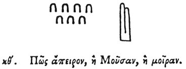

  
[Intangible Textual Heritage](../../index)  [Egypt](../index) 
[Index](index)  [Previous](hh101)  [Next](hh103) 

------------------------------------------------------------------------

[Buy this Book at
Amazon.com](https://www.amazon.com/exec/obidos/ASIN/1428631488/internetsacredte)

------------------------------------------------------------------------

*Hieroglyphics of Horapollo*, tr. Alexander Turner Cory, \[1840\], at
Intangible Textual Heritage

------------------------------------------------------------------------

### XXIX. HOW INFINITE, OR A SONG, OR FATE.

  [1](#fn_111)

SEVEN LETTERS INCLUDED WITHIN TWO FINGERS \[RINGS?\] [2](#fn_112) symbolize a *song*, or *infinite*, or
*fate*.

------------------------------------------------------------------------

### Footnotes

[106:1](hh102.htm#fr_116)

XXIX\. 1. *The number* 70 *is very common on funereal tablets, and
signifies* "*The Days of mourning*." Sh. 676. *The Egyptians still sing
their lamentations, perhaps a relic of the funereal chant called,
Maneros by Plutarch*.

2\. *An amulet with some mystic signification*.

[106:2](hh102.htm#fr_117) De Pauw. sug.
δακτυλίοις," rings."—Reuv. ἐντος δακτυλίου, "within a ring." Qy. Bent
into the form of a ring.

------------------------------------------------------------------------

[Next: XXX. What One Line Bent Over Another Signifies](hh103)
