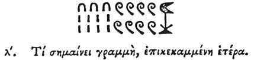

  
[Intangible Textual Heritage](../../index)  [Egypt](../index) 
[Index](index)  [Previous](hh102)  [Next](hh104) 

------------------------------------------------------------------------

[Buy this Book at
Amazon.com](https://www.amazon.com/exec/obidos/ASIN/1428631488/internetsacredte)

------------------------------------------------------------------------

*Hieroglyphics of Horapollo*, tr. Alexander Turner Cory, \[1840\], at
Intangible Textual Heritage

------------------------------------------------------------------------

### XXX. WHAT ONE LINE BENT OVER ANOTHER SIGNIFIES.

  [3](#fn_113)

A straight line with a curved line above it signifies TEN PLANE
LINES. [4](#fn_114)

------------------------------------------------------------------------

### Footnotes

[106:3](hh103.htm#fr_118)

xxx\. *The plane lines denote units, the curved* 10's, *the coils*
100's, *and the other* 1000's.

[106:4](hh103.htm#fr_119) Qy. When a curved
line is placed above a straight line it denotes ten of such straight
lines.

------------------------------------------------------------------------

[Next: XXXI. What They Denote by Depicting a Swallow](hh104)
