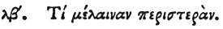

  
[Intangible Textual Heritage](../../index)  [Egypt](../index) 
[Index](index)  [Previous](hh104)  [Next](hh106) 

------------------------------------------------------------------------

[Buy this Book at
Amazon.com](https://www.amazon.com/exec/obidos/ASIN/1428631488/internetsacredte)

------------------------------------------------------------------------

*Hieroglyphics of Horapollo*, tr. Alexander Turner Cory, \[1840\], at
Intangible Textual Heritage

------------------------------------------------------------------------

### XXXII. WHAT BY A BLACK DOVE.

 

When they would symbolise *a woman who remains a widow till death*, they
depict a BLACK DOVE; for this bird has no connexion with another mate
from the time that it is widowed.

------------------------------------------------------------------------

[Next: XXXIII. What by an Ichneumon](hh106)
