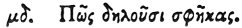

  
[Intangible Textual Heritage](../../index)  [Egypt](../index) 
[Index](index)  [Previous](hh116)  [Next](hh118) 

------------------------------------------------------------------------

[Buy this Book at
Amazon.com](https://www.amazon.com/exec/obidos/ASIN/1428631488/internetsacredte)

------------------------------------------------------------------------

*Hieroglyphics of Horapollo*, tr. Alexander Turner Cory, \[1840\], at
Intangible Textual Heritage

------------------------------------------------------------------------

### XLIV. HOW THEY DENOTE WASPS.

 

When they would denote *wasps*, they depict a DEAD HORSE; for many wasps
are generated from him when dead.

------------------------------------------------------------------------

[Next: XLV. How A Woman Who Miscarries](hh118)
