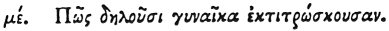

  
[Intangible Textual Heritage](../../index)  [Egypt](../index) 
[Index](index)  [Previous](hh117)  [Next](hh119) 

------------------------------------------------------------------------

[Buy this Book at
Amazon.com](https://www.amazon.com/exec/obidos/ASIN/1428631488/internetsacredte)

------------------------------------------------------------------------

*Hieroglyphics of Horapollo*, tr. Alexander Turner Cory, \[1840\], at
Intangible Textual Heritage

------------------------------------------------------------------------

### XLV. HOW A WOMAN WHO MISCARRIES.

 

When they would symbolise *a woman who miscarries*, they depict a MARE
KICKING A WOLF; for not only by

p. 115

kicking a wolf does a mare miscarry, but it immediately miscarries if it
should merely tread on the footstep of a wolf.

------------------------------------------------------------------------

[Next: XLVI. How a Man Who Cures Himself by an Oracle](hh119)
