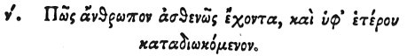

  
[Intangible Textual Heritage](../../index)  [Egypt](../index) 
[Index](index)  [Previous](hh122)  [Next](hh124) 

------------------------------------------------------------------------

[Buy this Book at
Amazon.com](https://www.amazon.com/exec/obidos/ASIN/1428631488/internetsacredte)

------------------------------------------------------------------------

*Hieroglyphics of Horapollo*, tr. Alexander Turner Cory, \[1840\], at
Intangible Textual Heritage

------------------------------------------------------------------------

p. 117

### L. HOW A MAN WHO IS WEAK AND PERSECUTED BY ANOTHER.

 

When they would symbolise *a man that is weak and persecuted by a
stronger*, they delineate a BUSTARD AND A HORSE; for this bird flies
away whenever it sees a horse.

------------------------------------------------------------------------

[Next: LI. How They Denote A Man Who Flees For Refuge to his Patron, and
Receives No Assistance](hh124)
