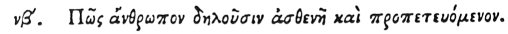

  
[Intangible Textual Heritage](../../index)  [Egypt](../index) 
[Index](index)  [Previous](hh124)  [Next](hh126) 

------------------------------------------------------------------------

[Buy this Book at
Amazon.com](https://www.amazon.com/exec/obidos/ASIN/1428631488/internetsacredte)

------------------------------------------------------------------------

*Hieroglyphics of Horapollo*, tr. Alexander Turner Cory, \[1840\], at
Intangible Textual Heritage

------------------------------------------------------------------------

### LII. HOW THEY REPRESENT A WEAK MAN THAT IS AUDACIOUS.

 

When they would symbolise *a man who is weak and audacious*, they
portray a BAT, for she flies though destitute of feathers.

------------------------------------------------------------------------

[Next: LIII. How a Woman Suckling and Bringing Up Her Children
Well](hh126)
