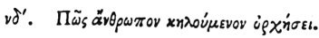

  
[Intangible Textual Heritage](../../index)  [Egypt](../index) 
[Index](index)  [Previous](hh126)  [Next](hh128) 

------------------------------------------------------------------------

[Buy this Book at
Amazon.com](https://www.amazon.com/exec/obidos/ASIN/1428631488/internetsacredte)

------------------------------------------------------------------------

*Hieroglyphics of Horapollo*, tr. Alexander Turner Cory, \[1840\], at
Intangible Textual Heritage

------------------------------------------------------------------------

p. 119

### LIV. HOW A MAN FOND OF DANCING.

 

When they would symbolise *a man fond of dancing and piping*, they
delineate a TURTLE DOVE; for it is taken by means of a pipe and dancing.

------------------------------------------------------------------------

[Next: LV. How a Mystic Man](hh128)
